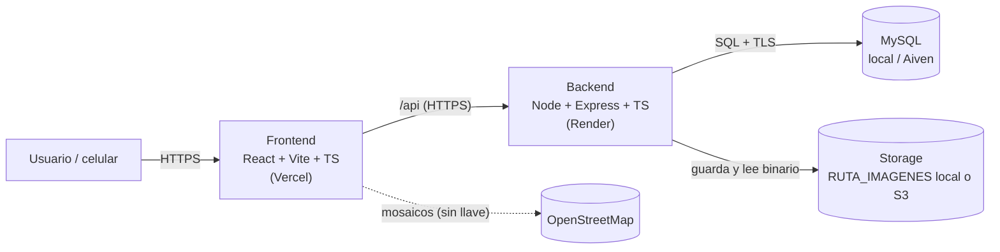
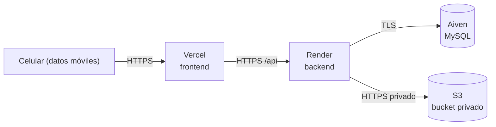

# PawFinder — Registro de perritos de la calle
***Este archivo puede ser visualizado más facilmente con Crtl+Shift+V***

Aplicación para registrar perritos de la calle: quien encuentra uno le toma una
foto (con cámara o subiendo una imagen), le pone un nombre, describe cómo es
(raza, color, tamaño, edad, pelaje) y marca en un mapa dónde lo vio. El registro
sirve a rescatistas, vecinos y asociaciones para saber qué perros hay, cómo
identificarlos y en qué zona andan.

Está pensada **primero para celular** (se usa en la calle) y adaptada a
computadora. Es un proyecto académico (Programación lógica y funcional); la
consigna completa está en [`proyecto1-perritos.pdf`](./proyecto1-perritos.pdf)
y el resumen operativo en [`MASTER_PROMPT.md`](./MASTER_PROMPT.md).

### Integrantes

| Integrante | Rol | Responsable de |
|---|---|---|
| Daniel Alejandro Sun Flores | **Backend** | API, validación del servidor, almacenamiento de imágenes, manejo de errores |
| Luis Sáenz Jiménez | **Frontend** | Pantallas, formulario, cámara/carga de foto, mapa, validaciones del cliente |
| Aldo Azael Orozco Badillo | **DBA** | Modelo de datos, migraciones, catálogos, datos de prueba, respaldo |

---

## 1. Descripción del proyecto

**Problema que resuelve:** cuando alguien encuentra un perrito perdido en la
calle no hay un lugar central donde reportarlo con foto, descripción y
ubicación para que rescatistas o vecinos lo reconozcan después.

**Qué hace el sistema:**

1. Un formulario web (`/registrar`) captura foto (cámara o archivo), nombre,
   raza, sexo, etapa de vida, tamaño, color y longitud del pelaje, patrón de
   pelaje, color de ojos, marcas distintivas (opcional) y ubicación (GPS o pin
   manual en un mapa).
2. El backend valida todo de nuevo (nunca confía en el cliente), valida que la
   foto sea una imagen real por su contenido binario, la comprime y la guarda.
3. El registro aparece de inmediato en el **mapa** (`/`) con un pin, en la
   **lista** (`/perritos`) con miniatura, y tiene una página de **detalle**
   (`/perritos/:id`).
4. Reenviar el mismo formulario dos veces (doble clic, mala señal) **no crea un
   duplicado**: el backend es idempotente.

**Componentes principales:** frontend (SPA), backend (API REST), base de datos
MySQL, almacenamiento de imágenes (disco local o S3), mapa (OpenStreetMap, sin
llave de API).

---

## 2. Arquitectura



- **Frontend:** SPA (React Router) que solo habla con el backend a través de
  `/api`. En desarrollo, Vite hace de proxy de `/api` hacia el backend (evita
  problemas de CORS y de mezclar `http`/`https`).
- **Backend:** valida todo, resuelve las consultas en SQL (no trae todo para
  filtrar en JavaScript) y sirve las fotos a través de un endpoint propio;
  **nunca** expone la carpeta de imágenes ni el bucket directamente.
- **Base de datos:** MySQL; no se expone a internet, solo el backend le habla
  (con TLS si es Aiven).
- **Storage:** abstracción (`StorageDriver`) con dos implementaciones
  intercambiables por variable de entorno: disco local o bucket S3 privado.

### Estructura del repositorio

```
frontend/    App web (React + Vite + TypeScript)
  src/
    api/          Cliente HTTP, tipos y errores
    pages/        Mapa, lista, detalle, registro
    components/   Layout, formulario, mapa
    config.ts     Lectura de variables VITE_
backend/     API REST (Node + Express + TypeScript)
  src/
    app.ts               Construye Express (inyecta pool, storage, repositorio)
    index.ts             Arranque (carga .env, valida config)
    config/env.ts        Esquemas Zod de configuración (loadEnv / loadDbEnv)
    db/pool.ts           Pool mysql2 + TLS para Aiven
    storage/             StorageDriver: local, s3, validación y compresión de imagen
    schemas/perrito.ts   Esquemas Zod del dominio (única fuente de verdad)
    repositories/        SQL declarativo (JOIN, agregación, idempotencia)
    mappers/             Transformaciones funcionales (fila de BD → JSON del API)
    routes/               health, perritos
    middleware/           Errores uniformes y validación
    docs/                 Documento OpenAPI generado desde los esquemas Zod
  tests/                 Vitest + Supertest
database/    Migraciones, seeds y scripts SQL
  migrations/            Esquema versionado 001…006, aplicado con database/scripts/migrate.ts
  seeds/                 Catálogos y perritos de prueba
  scripts/               migrate, seed, reset-local, backup, restore
docs/        Arquitectura, esquema de BD y despliegue (detalle ampliado de este README)
openspec/    Especificaciones y cambios (spec-driven development)
```

---

## 3. Requisitos previos (versiones)

| Herramienta | Versión requerida | Cómo comprobarla |
|---|---|---|
| Node.js | **22.12 o superior** (LTS 22 o 24; el equipo desarrolló con 22.22.2 y 24.14.1 en distintas máquinas) | `node --version` → debe empezar con `v22.12` o más, o `v24.x` |
| npm | 10 o superior (el equipo usó 11.11.0) | `npm --version` |
| MySQL | **8.0** (desarrollado con 8.0.46) o MariaDB 10.6+ compatible | `mysql --version` |
| Git | cualquier versión reciente | `git --version` |

**No se necesita Docker en ningún punto** (la consigna académica lo prohíbe
explícitamente; ver §25 para cómo se administra el servicio sin él).

### 3.1 Cómo instalar las herramientas (si aún no las tienes)

Si apenas empiezas, instala en este orden. Cierra y vuelve a abrir la terminal
después de cada instalación, y comprueba con el comando de la tabla de arriba.

- **Node.js (ya incluye npm):** descarga el instalador **LTS** desde
  <https://nodejs.org> (elige "LTS", no "Current") y sigue el asistente. No
  instales `npm` por separado: viene incluido con Node. Durante el asistente,
  deja marcada la opción **"Add to PATH"** (viene marcada por defecto) y
  **termina** la instalación hasta la pantalla final ("Finish"). Después
  **cierra todas las terminales abiertas** y abre una nueva; una terminal
  abierta antes de instalar no ve los programas nuevos.
- **Git:** descarga el instalador de <https://git-scm.com/downloads> y acepta
  las opciones por defecto.
- **MySQL:** no lo instales "de memoria"; tiene su propio paso a paso detallado
  (instalación, arranque del servicio, contraseña de `root` y verificación) en
  la sección 6.1. Léelo completo antes de llegar al Paso 4 de la instalación.

Si ya tienes todo instalado, salta a la sección 4.

#### Windows: `npm` no funciona después de instalar Node

Hay **dos errores distintos** que se parecen; identifica cuál es el tuyo.
Primero, en una terminal **nueva**, corre:

```
node --version
```

**A) `npm` / `node` "no se reconoce como el nombre de un cmdlet..." (PowerShell)
o "no se reconoce como un comando interno o externo" (cmd).** Windows no
encuentra Node: **no es un problema de permisos**, así que `npm.cmd` y
`Set-ExecutionPolicy` **no lo arreglan** (si `node --version` también falla,
es este caso). Sigue en orden hasta que `node --version` responda:

1. **Cierra todas las terminales y abre una nueva** (PowerShell o cmd). Es la
   causa más común: el PATH solo se lee al abrir la terminal. Si sigue igual,
   **reinicia Windows** y prueba de nuevo.
2. Comprueba que Node quedó instalado: abre el Explorador y busca la carpeta
   `C:\Program Files\nodejs\` (debe contener `node.exe` y `npm.cmd`).
   - **Si no existe:** la instalación no terminó o no se ejecutó. Vuelve a
     ejecutar el instalador `.msi` de <https://nodejs.org> hasta "Finish"
     (o, en PowerShell: `winget install OpenJS.NodeJS.LTS`) y repite el paso 1.
   - **Si existe** pero la terminal no lo reconoce, falta agregarla al PATH
     (paso 3).
3. Agregar Node al PATH manualmente: tecla Windows → escribe **"Editar las
   variables de entorno del sistema"** → *Variables de entorno…* → en
   *Variables de usuario* selecciona `Path` → *Editar* → *Nuevo* → pega
   `C:\Program Files\nodejs\` → *Aceptar* en todo. Cierra y abre una terminal
   nueva y prueba `node --version` y `npm --version`.
4. Solución rápida para probar sin tocar el PATH (solo esa terminal):
   ```
   "C:\Program Files\nodejs\npm.cmd" --version
   ```
   Si eso responde pero `npm` a secas no, el problema es el PATH (paso 3).

**B) *"npm.ps1 cannot be loaded because running scripts is disabled on this
system"* (solo PowerShell).** Aquí Node **sí** está instalado; es la política
de ejecución de scripts de Windows. Tres soluciones:
- Usar `npm.cmd` en vez de `npm` (`npm.cmd install`, `npm.cmd run dev`), o
- Abrir una terminal **cmd** (Símbolo del sistema) en vez de PowerShell, o
- Permitirlo para tu usuario una sola vez, **en PowerShell** (no en cmd, donde
  este comando no existe):
  `Set-ExecutionPolicy -Scope CurrentUser -ExecutionPolicy RemoteSigned`

> En cmd no existen comandos de PowerShell ni de Linux como `ls` (usa `dir`)
> ni `Set-ExecutionPolicy`. Si ves "no se reconoce" con ellos, es normal y no
> indica un problema de instalación.

**macOS/Linux:** no se probó explícitamente en el repositorio más allá de lo
anterior; los comandos de este README dan la variante de cada sistema donde
difieren (`copy` vs `cp`).

---

## 4. Instalación paso a paso

### Paso 1 — Clonar el repositorio

```bash
git clone https://github.com/DanielSunCODE/pawFinder.git
cd pawFinder
```

Deberías quedar parado en una carpeta que contiene, entre otras cosas,
`backend/`, `frontend/`, `database/`, `docs/` y este mismo `README.md`.

### Paso 2 — Instalar todas las dependencias

El repositorio es un **monorepo con npm workspaces** (`backend`, `frontend`,
`database`): hay un solo `package-lock.json` en la raíz y todo se instala desde
ahí, nunca entrando a cada carpeta por separado.

```bash
npm install
```

Resultado esperado: se crea una sola carpeta `node_modules/` en la raíz (con
subcarpetas internas para cada workspace) y no debería haber errores rojos al
final. Si `npm install` falla por la versión de Node, revisa la sección 3.

### Paso 3 — Copiar y editar los archivos de entorno

Hay **dos** `.env` distintos: uno del backend y uno del frontend. Copia ambos:

```bash
# Windows (cmd o PowerShell)
copy backend\.env.example backend\.env
copy frontend\.env.example frontend\.env.local

# Linux / macOS / Git Bash
cp backend/.env.example backend/.env
cp frontend/.env.example frontend/.env.local
```

Ninguno de los dos se sube al repositorio (`.gitignore` los excluye). **Copiar
no basta:** ahora ábrelos con un editor de texto (Bloc de notas, VS Code, lo que
tengas) y ajusta los valores marcados abajo.

En `backend/.env` (es el que más importa):

| Variable | Qué poner |
|---|---|
| `DB_PASSWORD` | La contraseña que le pusiste a `root` al instalar MySQL. Si la dejaste vacía, deja esto vacío. **Es la causa #1 de "Access denied".** |
| `DB_USER` | `root` mientras pruebas en tu máquina. |
| `DB_NAME` | `pawfinder` (el mismo nombre que usarás al crear la base en el Paso 4). |
| `RUTA_IMAGENES` | Una carpeta real **fuera del proyecto**, por ejemplo `C:/Users/TU_USUARIO/pawfinder-imagenes` en Windows o `/home/TU_USUARIO/pawfinder-imagenes` en Linux/macOS. Reemplaza `TU_USUARIO` por tu usuario: la carpeta se crea sola, pero la ruta debe ser válida. |

En `frontend/.env.local` **no hace falta tocar nada** para trabajar en tu
computadora: los valores por defecto ya apuntan a `localhost`.

El detalle de cada variable está en la sección 5.

### Paso 4 — Instalar MySQL y crear la base de datos

Este es el paso que más se traba la primera vez. Si nunca instalaste una base de
datos, la sección 6.1 lo explica completo (instalar, arrancar el servicio, entrar
a la consola y crear la base). El resumen es:

1. Instalar MySQL Server (sección 6.1).
2. **Arrancar el servicio** y confirmar que está corriendo (sección 6.1.4).
3. Crear la base de datos (sección 6.1.6):

   ```sql
   CREATE DATABASE pawfinder CHARACTER SET utf8mb4 COLLATE utf8mb4_0900_ai_ci;
   ```

`db:migrate` **no crea la base**, solo las tablas: por eso hay que hacer este
`CREATE DATABASE` antes.

### Paso 5 — Aplicar el esquema y cargar datos de prueba

Con `backend/.env` ya editado (Paso 3) y la base creada (Paso 4):

```bash
npm run db:migrate
npm run db:seed
```

Resultado esperado: una línea `+ 00X_archivo.sql aplicada` por cada migración, y
al sembrar el aviso de los catálogos y los 16 perritos de prueba cargados.

### Paso 6 — Levantar el proyecto

```bash
npm run dev
```

Resultado esperado: en la misma terminal aparecen, con colores distintos, los
logs de `backend` (`Backend escuchando en http://localhost:3000`) y de
`frontend` (`Local: http://localhost:5173/`). Abre
`http://localhost:5173` en el navegador.

Si algo falla en este paso, revisa la sección 14 (Problemas comunes) antes de
seguir.

---

## 5. Configuración de variables de entorno

### Backend (`backend/.env`, copiado de `backend/.env.example`)

| Variable | Obligatoria | Ejemplo | Descripción |
|---|---|---|---|
| `NODE_ENV` | No (default `development`) | `development` | `development`, `test` o `production`. |
| `PORT` | No (default `3000`) | `3000` | Puerto del API. |
| `CORS_ORIGIN` | No (default `http://localhost:5173`) | `http://localhost:5173` | Orígenes permitidos, separados por coma. |
| `DB_HOST` | No (default `localhost`) | `localhost` | Host de MySQL (local o Aiven). |
| `DB_PORT` | No (default `3306`) | `3306` | Puerto de MySQL. |
| `DB_USER` | **Sí** | `root` | Usuario de MySQL. |
| `DB_PASSWORD` | No (default vacío) | *(vacío en local)* | Contraseña de MySQL. |
| `DB_NAME` | **Sí** | `pawfinder` | Nombre de la base de datos. |
| `DB_CONNECTION_LIMIT` | No (default `10`) | `10` | Máximo de conexiones simultáneas del pool. |
| `DB_SSL` | No (default `false`) | `false` | `true` para Aiven (TLS obligatorio ahí). |
| `DB_SSL_CA` | Solo si `DB_SSL=true` | `./certs/aiven-ca.pem` | Ruta a un `.pem` **o** el PEM completo pegado entre comillas dobles. |
| `STORAGE_DRIVER` | No (default `local`) | `local` | `local` o `s3`. |
| `RUTA_IMAGENES` | Solo si `STORAGE_DRIVER=local` | Windows: `C:/Users/tu_usuario/pawfinder-imagenes` · Linux/macOS: `/home/tu_usuario/pawfinder-imagenes` | Carpeta **fuera del proyecto**; se crea sola al guardar la primera foto. |
| `IMAGE_MAX_BYTES` | No (default `5242880`) | `5242880` | Tamaño máximo por imagen subida (5 MB). |
| `IMAGE_MAX_DIMENSION` | No (default `1600`) | `1600` | Lado mayor al que se reescala la foto guardada. |
| `IMAGE_QUALITY` | No (default `80`) | `80` | Calidad (1–100) de la compresión. |
| `IMAGE_OUTPUT_FORMAT` | No (default `webp`) | `webp` | Formato de salida: `webp` o `jpeg`. |
| `AWS_REGION` | Solo si `STORAGE_DRIVER=s3` | `us-east-1` | Región del bucket. |
| `AWS_S3_BUCKET` | Solo si `STORAGE_DRIVER=s3` | `pawfinder-imagenes` | Nombre del bucket privado. |
| `AWS_ACCESS_KEY_ID` | Solo si `STORAGE_DRIVER=s3` | `AKIA...` | Credencial IAM (nunca se sube al repo). |
| `AWS_SECRET_ACCESS_KEY` | Solo si `STORAGE_DRIVER=s3` | `tu_secreto` | Credencial IAM (nunca se sube al repo). |
| `PUBLIC_BASE_URL` | No | `http://localhost:3000` | URL pública del backend, usada para construir `fotoUrl`. |
| `OPENAPI_SERVER_URL` | No | `http://localhost:3000` | URL que Swagger UI muestra como servidor del API. |

> El `.env` real **nunca** se sube al repositorio. La CA de Aiven es pública
> (no es un secreto en sí), pero igual va en `.env` y no se versiona. Si pegas
> el PEM completo en vez de una ruta, debe ir **entre comillas dobles**; sin
> comillas, `.env` solo toma la primera línea y la conexión falla.

Todas estas variables están validadas con **Zod** en `backend/src/config/env.ts`:
si falta una obligatoria, o falta lo requerido por el modo de storage elegido,
el backend **no arranca** y muestra en consola exactamente qué variable falta.

### Frontend (`frontend/.env.local`, copiado de `frontend/.env.example`)

| Variable | Obligatoria | Ejemplo | Descripción |
|---|---|---|---|
| `VITE_API_URL` | No (default `/api`) | `/api` | URL base del API vista por el navegador. En desarrollo se deja así y el proxy de Vite la reenvía. |
| `BACKEND_URL` | No (default `http://localhost:3000`) | `http://localhost:3000` | A dónde reenvía el proxy de Vite las peticiones `/api`. Solo lo lee `vite.config.ts` (Node), no el navegador. |
| `VITE_MAPA_CENTRO` | No (default `19.4326,-99.1332`, Zócalo CDMX) | `25.6866,-100.3161` | Centro inicial del mapa, `"latitud,longitud"`. |
| `VITE_MAPA_ZOOM` | No (default `13`) | `13` | Zoom inicial. |
| `VITE_MAPA_MOSAICOS_URL` | No | *(vacío)* | Proveedor de mapas alternativo; vacío = OpenStreetMap (sin llave). |
| `VITE_MAPA_MOSAICOS_CREDITOS` | No | *(vacío)* | Créditos que exige ese proveedor alternativo. |

El frontend **no** guarda contraseñas ni llaves: cualquier variable que
empiece con `VITE_` termina visible en el navegador (el código fuente del
bundle la incluye tal cual).

---

## 6. Base de datos

### 6.1 Instalar MySQL localmente (paso a paso)

Salta esta sección solo si ya tienes un servidor MySQL en otro lado (por ejemplo
Aiven): en ese caso ve directo a 6.2.

> **Antes de empezar:** anota la contraseña que le pongas al usuario `root`. La
> necesitas en `backend/.env` (`DB_PASSWORD`). Olvidarla es el error más común
> después ("Access denied for user 'root'").

#### 6.1.1 Windows

1. Descarga el **MySQL Installer** desde
   <https://dev.mysql.com/downloads/installer/> (el archivo
   `mysql-installer-community-*.msi`; no hace falta crear cuenta, busca el
   enlace *"No thanks, just start my download"*).
2. Ejecútalo (Windows pedirá permiso de administrador). En el tipo de
   instalación elige **Server only** (solo el servidor, lo más simple). Si
   además quieres una interfaz gráfica, marca también **MySQL Workbench**.
3. *Type and Networking*: deja **Development Computer** y el puerto **3306**.
4. *Authentication Method*: deja la opción recomendada (**Strong Password
   Encryption**).
5. *Accounts and Roles*: escribe una contraseña para **root** y **apúntala**.
6. *Windows Service*: deja marcado **Configure MySQL Server as a Windows
   Service** y **Start the MySQL Server at System Startup**. Así MySQL arranca
   solo al prender la computadora y no tienes que iniciarlo a mano cada vez.
7. Pulsa **Execute**, espera a que termine y luego **Finish**.

**Para usar MySQL en Windows**, abre del menú Inicio **"MySQL 8.0 Command Line
Client"**: te pide la contraseña de root y te deja en el prompt `mysql>`, listo
para los comandos de 6.1.6. (Si quieres escribir `mysql` desde PowerShell/cmd,
hay que agregar `C:\Program Files\MySQL\MySQL Server 8.0\bin` al `PATH`; no es
necesario para seguir esta guía.)

#### 6.1.2 macOS

La vía más simple es Homebrew (<https://brew.sh>; si no lo tienes, instálalo con
el comando de una línea que indica su web):

```bash
brew install mysql
brew services start mysql
```

Homebrew deja `root` **sin contraseña** en local (puedes entrar con
`mysql -u root`). Si quieres ponerle una, corre `mysql_secure_installation`.

#### 6.1.3 Linux (Debian/Ubuntu)

```bash
sudo apt update
sudo apt install mysql-server
sudo systemctl enable --now mysql
```

En Ubuntu el `root` de MySQL entra con `sudo mysql` (autenticación por socket,
sin contraseña). En Fedora/RHEL el paquete es `mysql-server` y el servicio se
llama `mysqld`.

#### 6.1.4 Comprobar que MySQL está corriendo

`db:migrate` fallará con `Can't connect to MySQL server` si el servicio está
apagado. Compruébalo según tu sistema:

| Sistema | Comando | Debe mostrar |
|---|---|---|
| Windows | `Get-Service MySQL*` (PowerShell) | `Status: Running`. Si no: `Start-Service MySQL80` |
| macOS | `brew services list` | `mysql  started` |
| Linux | `sudo systemctl status mysql` | `active (running)` |

Y que el cliente esté instalado:

```bash
mysql --version
```

#### 6.1.5 Entrar a la consola de MySQL

| Sistema | Cómo |
|---|---|
| Windows | Abre **"MySQL 8.0 Command Line Client"** desde el menú Inicio |
| macOS | `mysql -u root -p` (o `mysql -u root` si no le pusiste contraseña) |
| Linux | `sudo mysql` |

Cuando veas el prompt `mysql>`, ya estás dentro. Para salir: `exit`.

#### 6.1.6 Crear la base de datos

Ya dentro de la consola:

```sql
CREATE DATABASE pawfinder CHARACTER SET utf8mb4 COLLATE utf8mb4_0900_ai_ci;
```

> Si da `Unknown collation: 'utf8mb4_0900_ai_ci'`, estás en MariaDB (u otro
> MySQL antiguo): usa `COLLATE utf8mb4_unicode_ci` en su lugar.

Opcional: en vez de `root`, crea un usuario solo para este proyecto. Si eres
nuevo, **sáltalo** y usa `root`:

```sql
CREATE USER 'pawfinder'@'localhost' IDENTIFIED BY 'una_contraseña';
GRANT ALL PRIVILEGES ON pawfinder.* TO 'pawfinder'@'localhost';
FLUSH PRIVILEGES;
```

Por último, confirma que `backend/.env` (Paso 3) apunta a esto: `DB_HOST`,
`DB_PORT`, `DB_USER`, `DB_PASSWORD` y `DB_NAME`.

### 6.2 Aplicar el esquema (migraciones)

```bash
npm run db:migrate
```

Es **idempotente**: se puede correr varias veces sin romper nada (usa una
tabla `schema_migrations` para no reaplicar lo que ya corrió). Aplica en orden
`database/migrations/001_catalogs.sql` → `006_raza_y_color_ojos_requeridos.sql`:
crea los catálogos (razas, colores, colores de ojos, patrones de pelaje), la
tabla principal `perros`, la relación `perro_colores` y la tabla de
`idempotencia`.

Resultado esperado en consola: una línea `+ 00X_archivo.sql aplicada` por cada
migración nueva.

### 6.3 Cargar catálogos y datos de prueba (seeds)

```bash
npm run db:seed
```

Carga **26 razas** (incluye "Sin raza definida / Criollo"), **12 colores**, 6
colores de ojos, 18 patrones de pelaje, y **16 perritos de prueba**. Si
`STORAGE_DRIVER=local`, además genera una foto PNG válida por cada perrito
dentro de `RUTA_IMAGENES` (para que la app se vea completa sin tener que
versionar imágenes pesadas en el repo).

> Correr `db:seed` dos veces sobre la misma base falla (los datos de prueba
> tienen restricciones `UNIQUE`). Para repetir desde cero, usa `db:reset`.

### 6.4 Recrear la base local desde cero (opcional)

```bash
npm run db:reset
```

Hace `DROP DATABASE` + `CREATE DATABASE` + migrar + sembrar, en un solo
comando. **Se niega a correr si `DB_HOST` no es `localhost`/`127.0.0.1`**, como
protección para no destruir por accidente una base de Aiven/producción.

### 6.5 Verificar que quedó bien

```sql
SHOW TABLES;
-- razas, colores, colores_ojos, patrones_pelaje, perros, perro_colores, idempotencia, schema_migrations

SELECT COUNT(*) FROM perros;        -- 16
SELECT COUNT(*) FROM razas;         -- 26
```

Diagrama entidad-relación y detalle de cada tabla/constraint:
[`docs/database-schema.md`](./docs/database-schema.md).

---

## 7. Almacenamiento de imágenes

Dos drivers intercambiables por la variable `STORAGE_DRIVER`, con la misma
interfaz (`guardar`/`leer`) en `backend/src/storage/index.ts`:

### Modo `local` (por defecto)

- Las imágenes se guardan en `RUTA_IMAGENES`, una carpeta que **debe estar
  fuera del proyecto** (por ejemplo `D:\CODING\imagenes-pawfinder` o
  `/home/tu_usuario/pawfinder-imagenes`), nunca dentro de `backend/` ni
  versionada en Git.
- La carpeta se crea sola (`mkdir` recursivo) la primera vez que se guarda una
  imagen; no hace falta crearla a mano.
- El **nombre del archivo lo genera el backend** (un UUID + extensión); nunca
  se usa el nombre que mandó quien sube la foto, para evitar colisiones y
  ataques de "path traversal".

### Modo `s3`

- Sube/lee objetos de un **bucket privado** de AWS S3 vía `@aws-sdk/client-s3`.
  Requiere `AWS_REGION`, `AWS_S3_BUCKET`, `AWS_ACCESS_KEY_ID` y
  `AWS_SECRET_ACCESS_KEY`.
- El bucket no tiene ACL pública: solo el backend, con esas credenciales, puede
  leer o escribir objetos.
- Guía completa para crear el bucket, el usuario IAM con permiso mínimo y
  probarlo: [`docs/deployment.md` §5](./docs/deployment.md).

### Cómo se sirven las fotos (en ambos modos)

- La base solo guarda `ruta_imagen` (el nombre/clave del archivo), **nunca**
  una URL pública ni una ruta absoluta del sistema.
- El único camino de lectura es `GET /api/perritos/{id}/foto`: el backend
  busca `ruta_imagen` en la base, la lee con el driver activo, y responde el
  binario con su `Content-Type`. El cliente **nunca** ve la carpeta local ni el
  nombre/URL del bucket.
- Antes de guardarse, toda imagen se **valida por contenido** (firma binaria /
  "magic bytes" con la librería `file-type`, no por extensión ni
  `Content-Type`, que se pueden falsificar) y se **comprime** con `sharp`
  (reescalada al lado mayor `IMAGE_MAX_DIMENSION`, reencodeada en
  `IMAGE_OUTPUT_FORMAT` con calidad `IMAGE_QUALITY`, y se descartan los
  metadatos EXIF, incluido el GPS de la foto original).

---

## 8. Ejecución del backend

```bash
npm run dev:backend
# equivalente: npm run dev --workspace @pawfinder/backend
```

- Carpeta: se ejecuta desde la **raíz** del repositorio (usa los workspaces).
- Puerto: `3000` (o el que definas en `PORT`).
- URL: `http://localhost:3000`
- Documentación interactiva: `http://localhost:3000/api/docs` (Swagger UI)
- Documento OpenAPI en JSON: `http://localhost:3000/api/openapi.json`
- Cómo saber que inició bien: la consola muestra
  `Backend escuchando en http://localhost:3000`. Si falta una variable de
  entorno obligatoria, en vez de eso muestra
  `No se pudo iniciar el backend: Configuracion de entorno invalida...` y
  termina el proceso (no se queda "colgado" a medias).

**Modo producción** (compilado): `npm run build --workspace @pawfinder/backend`
genera `backend/dist/`; se arranca con `node dist/index.js` (variables de
entorno reales del sistema en vez de `backend/.env`, ver `backend/src/index.ts`).

---

## 9. Ejecución del frontend

```bash
npm run dev:frontend
# equivalente: npm run dev --workspace @pawfinder/frontend
```

- Carpeta: desde la raíz (o desde `frontend/` con `npm run dev`).
- Puerto: `5173` (Vite; si está ocupado, usa el siguiente libre y lo indica en
  consola).
- URL: `http://localhost:5173`
- La app **necesita el backend corriendo**: si no lo está, cada pantalla
  muestra "No pudimos conectar con el servidor" con un botón para reintentar,
  en vez de un error críptico.

**Terminales separadas o una sola:**

```bash
# Una sola terminal, ambos a la vez
npm run dev

# Terminal 1
npm run dev:backend

# Terminal 2
npm run dev:frontend
```

**Modo producción:** `npm run build --workspace @pawfinder/frontend` genera
`frontend/dist/` (estático); lo sirve un proxy inverso (ver §25).

---

## 10. Probar desde un celular en la misma red

Los navegadores solo dan **cámara y ubicación** en `https://` o en
`localhost`. Desde el celular la dirección de tu computadora nunca es
`localhost`, así que existe un modo con HTTPS autofirmado:

```bash
npm run dev:red --workspace @pawfinder/frontend
```

1. La terminal muestra una URL de red, por ejemplo `https://192.168.1.50:5173/`.
   Ábrela **desde el celular**, con el celular y la computadora en la **misma
   red Wi-Fi**.
2. El navegador del celular va a advertir que el certificado no es de
   confianza (es autofirmado, no de una autoridad real): elige
   *Avanzado → Continuar* (o equivalente). Es normal en desarrollo, no en
   producción (donde Vercel/Render dan un certificado real).
3. Si la página no carga: en Windows, cuando Node.js pida permiso en el
   **Firewall**, permítelo para **redes privadas**.
4. El backend puede seguir corriendo en `localhost` de la computadora: el
   celular solo le habla a Vite por HTTPS, y Vite reenvía `/api` al backend
   por HTTP dentro de la misma máquina.

**Qué NO debe exponerse:** el puerto de MySQL (3306) no debe abrirse en el
router/firewall hacia la red; solo el 5173 (frontend, en este modo de prueba)
necesita ser alcanzable desde el celular.

---

## 11. Endpoints de la API

Formato uniforme en toda la API: éxito `{ "data": ... }`, error
`{ "error": { "message": "...", "details"?: [{ "field", "message" }] } }`. Todos
se pueden explorar y probar en vivo desde `/api/docs` (Swagger UI), generado
desde los mismos esquemas Zod que validan cada endpoint (`backend/src/docs/`).

| Método | Endpoint | Descripción | Parámetros | Body | Respuesta |
|---|---|---|---|---|---|
| GET | `/api/health` | Estado del servicio | — | — | `200 { data: { status: "ok", uptime, timestamp } }` |
| GET | `/api/perritos` | Listar/filtrar perritos | query: `busqueda`, `colorId`, `razaId` (todos opcionales) | — | `200 { data: Perrito[] }` |
| GET | `/api/perritos/{id}` | Detalle de un perrito | path: `id` (entero positivo) | — | `200 { data: Perrito }` · `404` si no existe |
| POST | `/api/perritos` | Registrar un perrito | header **`Idempotency-Key`** (obligatorio, 8–64 caracteres) | `multipart/form-data`: campos de texto + archivo `foto` (ver abajo) | `201 { data: Perrito }` (igual en reintento con la misma clave) |
| GET | `/api/perritos/{id}/foto` | Foto del perrito | path: `id` | — | `200` binario `image/jpeg`\|`image/png`\|`image/webp` · `404` |
| GET | `/api/razas` | Catálogo de razas | — | — | `200 { data: { id, nombre }[] }` |
| GET | `/api/colores` | Catálogo de colores de pelo | — | — | `200 { data: { id, nombre, hex }[] }` |
| GET | `/api/colores-ojos` | Catálogo de colores de ojos | — | — | `200 { data: { id, nombre, hex }[] }` |
| GET | `/api/patrones-pelaje` | Catálogo de patrones de pelaje | — | — | `200 { data: { id, nombre }[] }` |
| GET | `/api/estadisticas` | Conteo agregado (SQL `GROUP BY`) | — | — | `200 { data: { total, porColor: [{id,nombre,total}] } }` |
| GET | `/api/openapi.json` | Documento OpenAPI 3.1 | — | — | `200` JSON |
| GET | `/api/docs` | Swagger UI | — | — | `200` HTML |

No hay autenticación: la consigna del proyecto no la pide (ver
`MASTER_PROMPT.md`).

### Campos del body de `POST /api/perritos`

Se puede mandar como **campos individuales** del multipart (lo que documenta
Swagger UI) o como un solo campo `datos` con el JSON completo (compatibilidad).

| Campo | Obligatorio | Regla |
|---|---|---|
| `nombre` | Sí | Texto no vacío (solo espacios no cuenta), máx. 60 caracteres |
| `razaId` | Sí | Entero positivo del catálogo `/api/razas` |
| `sexo` | Sí | `macho` \| `hembra` |
| `etapaVida` | Sí | `cachorro` \| `adulto` \| `senior` |
| `tamano` | Sí | `pequeño` \| `mediano` \| `grande` \| `gigante` |
| `longitudPelaje` | Sí | `corto` \| `mediano` \| `largo` |
| `patronPelajeId` | Sí | Entero positivo del catálogo `/api/patrones-pelaje` |
| `colorOjosId` | Sí | Entero positivo del catálogo `/api/colores-ojos` |
| `colorPrincipalId` | Sí | Entero positivo del catálogo `/api/colores` |
| `coloresAdicionalesIds` | No | 0 a 2 ids, sin repetir el principal ni repetirse entre sí |
| `marcasDistintivas` | No | Texto libre, máx. 500 caracteres |
| `latitud` | Sí | Número entre -90 y 90 |
| `longitud` | Sí | Número entre -180 y 180 |
| `foto` | Sí | Archivo JPG, PNG o WEBP (validado por contenido, no por nombre) |

### Ejemplos con `curl`

```bash
# Listar, filtrando por color
curl "http://localhost:3000/api/perritos?colorId=1"

# Detalle
curl "http://localhost:3000/api/perritos/1"

# Registrar (idempotente: repetir con la misma Idempotency-Key no duplica)
curl -X POST http://localhost:3000/api/perritos \
  -H "Idempotency-Key: 3b1a2c4d-5e6f-4a7b-8c9d-0e1f2a3b4c5d" \
  -F "nombre=Luna" \
  -F "razaId=2" \
  -F "sexo=hembra" \
  -F "etapaVida=adulto" \
  -F "tamano=mediano" \
  -F "longitudPelaje=corto" \
  -F "patronPelajeId=4" \
  -F "colorOjosId=3" \
  -F "colorPrincipalId=1" \
  -F "coloresAdicionalesIds=2" \
  -F "latitud=25.686614" \
  -F "longitud=-100.313812" \
  -F "foto=@./luna.jpg"

# Foto (guarda el binario en un archivo)
curl "http://localhost:3000/api/perritos/1/foto" -o foto.webp
```

Respuesta de ejemplo de `POST /api/perritos` (201):

```json
{
  "data": {
    "id": 42,
    "nombre": "Luna",
    "fotoUrl": "http://localhost:3000/api/perritos/42/foto",
    "raza": { "id": 2, "nombre": "Husky Siberiano" },
    "colorPrincipal": { "id": 1, "nombre": "Negro", "hex": null },
    "coloresAdicionales": [{ "id": 2, "nombre": "Blanco", "hex": null }],
    "sexo": "hembra",
    "etapaVida": "adulto",
    "tamano": "mediano",
    "longitudPelaje": "corto",
    "patronPelaje": { "id": 4, "nombre": "Bicolor" },
    "colorOjos": { "id": 3, "nombre": "Azul", "hex": null },
    "marcasDistintivas": null,
    "latitud": 25.686614,
    "longitud": -100.313812,
    "fechaRegistro": "2026-09-26T18:40:00.000Z"
  }
}
```

Respuesta de error (400, validación):

```json
{
  "error": {
    "message": "Revisa los datos enviados.",
    "details": [{ "field": "nombre", "message": "El nombre no puede estar vacío." }]
  }
}
```

### Códigos HTTP usados

| Código | Cuándo |
|---|---|
| `200` | Consulta exitosa |
| `201` | Perrito registrado (o devuelto por idempotencia) |
| `400` | Datos, filtros o foto inválidos; falta el header `Idempotency-Key` |
| `404` | Recurso no encontrado (perrito, foto, o ruta que no existe) |
| `500` | Error inesperado del servidor |

---

## 12. Pruebas del sistema

**Manual, con la app corriendo (`npm run dev`):**

1. **Crear registro:** abre `http://localhost:5173/registrar`, llena el
   formulario (usa la cámara o sube una imagen), marca un punto en el mapa, y
   envía. Debe redirigir al detalle del perrito recién creado.
2. **Consultar registro:** en `/perritos/{id}` (el id que acabas de crear)
   deben verse todos los datos y la foto.
3. **Búsqueda/filtros:** en `/perritos`, usa el buscador y los filtros de color
   o raza; la lista debe actualizarse sin recargar la página.
4. **Mapa:** en `/` debe aparecer un pin por cada perrito; al tocar un pin se
   ve su foto, nombre y colores.
5. **Doble envío (idempotencia):** en el formulario, presiona "Enviar" y, sin
   esperar la respuesta, comprueba en las herramientas de red que si la
   petición se reintenta con la misma clave, la base **no** gana un segundo
   registro (`SELECT COUNT(*) FROM perros` antes y después debe dar el mismo
   número tras un reintento exitoso).

**Automatizado:**

```bash
npm run test:backend          # Vitest + Supertest: incluye backend/tests/perritos.test.ts
                               # (idempotencia, validación de cada campo, doble envío,
                               #  filtros, formato de la respuesta)
npm run db:typecheck          # tipos de los scripts de base de datos
npm run test --workspace @pawfinder/frontend   # reglas de validación del formulario, idempotencia, utilidades
npm run ci                    # todo junto: lint + tipos + pruebas + build, backend y frontend
```

Las pruebas del backend usan **dobles** (un repositorio y un storage simulados,
inyectados en `createApp`) — no tocan una base de datos real ni la red, así que
corren igual en tu máquina y en CI sin necesitar `backend/.env`.

---

## 13. Capturas de pantalla

Capturas reales desde celular, con datos reales de la app; los archivos están
en [`docs/capturas/`](./docs/capturas).

| Mapa | Lista (filtro por color) | Detalle |
|---|---|---|
|  |  |  |

| Formulario | Validación (falta la foto) |
|---|---|
|  |  |

Cubren: mapa con pines, lista con filtro, detalle de un registro, formulario
de registro con foto, y un ejemplo de mensaje de error entendible ("falta la
foto", no "Error 400"). Si se agregan más pantallas en el futuro (por ejemplo,
la cámara abierta en el momento de tomar la foto), agrega el archivo a
`docs/capturas/` y una fila más a estas tablas.

---

## 14. Problemas comunes

| Síntoma | Causa | Solución |
|---|---|---|
| `Configuracion de entorno invalida o incompleta: DB_USER` | Falta definir variables obligatorias en `backend/.env` | Revisa la tabla de la sección 5; copia de nuevo `backend/.env.example` si hace falta |
| `Access denied for user ...` | Usuario/contraseña de MySQL incorrectos | Revisa `DB_USER`/`DB_PASSWORD` en `backend/.env` (la contraseña de `root` que pusiste al instalar, sección 6.1) |
| `Can't connect to MySQL server on 'localhost'` / `ECONNREFUSED ...:3306` | El servicio de MySQL está apagado | Arranca el servicio: sección 6.1.4 |
| `Unknown database 'pawfinder'` | No creaste la base; `db:migrate` no la crea | Créala con `CREATE DATABASE`: sección 6.1.6 |
| `Unknown collation: 'utf8mb4_0900_ai_ci'` | Estás en MariaDB, que no conoce esa collation | Crea la base con `... COLLATE utf8mb4_unicode_ci`: sección 6.1.6 |
| `'mysql' no se reconoce como un comando...` | El cliente no está en el `PATH` (Windows) | Usa el acceso directo "MySQL 8.0 Command Line Client": sección 6.1.5 |
| `DB_SSL=true requiere DB_SSL_CA` | Falta el certificado CA cuando se usa Aiven | Define `DB_SSL_CA` con la ruta al `.pem` o el PEM entre comillas dobles |
| Error de TLS al conectar con Aiven (`unable to verify the first certificate`) | El PEM quedó truncado o mal pegado | Envuélvelo en comillas dobles en `.env`, o usa una **ruta** a un archivo en vez de pegarlo |
| `RUTA_IMAGENES es obligatoria` | Falta definir la carpeta de imágenes en modo `local` | Define `RUTA_IMAGENES` con una ruta **fuera** del proyecto |
| "No pudimos conectar con el servidor" (frontend) | El backend no está corriendo, o `BACKEND_URL` está mal | Levanta `npm run dev:backend`; revisa `frontend/.env.local` |
| La ubicación o la cámara no funcionan en el celular | Se abrió por `http://IP` en vez de HTTPS | Usa `npm run dev:red` y abre la URL `https://` que muestra la terminal |
| El mapa se ve gris | Sin internet, o la red bloquea `tile.openstreetmap.org` | Prueba con otra red; revisa un firewall corporativo/escolar |
| El mapa dice "API KEY REQUIRED" | `VITE_MAPA_MOSAICOS_URL` apunta a un proveedor que pide llave (ej. CARTO) | Déjala vacía para usar OpenStreetMap (sin llave) |
| `db:seed` falla por `ruta_imagen` duplicada | Ya se sembró antes | Usa `npm run db:reset` para empezar de cero |
| `db:reset` se cancela con un mensaje de "solo local" | `DB_HOST` no es `localhost`/`127.0.0.1` | Es intencional: protección para no borrar Aiven/producción por accidente |
| `npm` / `node` "no se reconoce como el nombre de un cmdlet" (PowerShell) o "como un comando interno o externo" (cmd) | Node.js no está instalado o no está en el `PATH` (terminal abierta antes de instalar, o instalación incompleta). `npm.cmd` **no** lo arregla | Cierra todas las terminales y abre una nueva; si sigue, reinicia Windows, verifica `C:\Program Files\nodejs\` y agrégalo al `PATH` (sección 3.1, caso A) |
| PowerShell: `npm.ps1 cannot be loaded...` | Windows bloquea scripts `.ps1` (Node sí está instalado) | Usa `npm.cmd`, la terminal `cmd`, o cambia la política de ejecución en PowerShell (sección 3.1, caso B) |
| Puerto 5173 u 3000 ocupado | Otro proceso ya lo usa | Vite prueba el siguiente puerto libre solo; para el backend, cambia `PORT` en `backend/.env` |
| CORS bloqueado en el navegador | `CORS_ORIGIN` del backend no incluye el origen del frontend | Agrega la URL exacta (con protocolo) a `CORS_ORIGIN`, separadas por coma si son varias |
| Migraciones no aplican cambios nuevos a una tabla ya creada | Las migraciones usan `CREATE TABLE IF NOT EXISTS`: si la tabla ya existe, MySQL ignora la nueva definición | Escribe una migración nueva con `ALTER TABLE` (como `004`–`006`), no edites una ya aplicada |

---

## 15. Paradigmas

El proyecto usa, a propósito, más de un paradigma de programación.

- **Declarativo** — el SQL de `database/migrations/` y `database/seeds/`, y las
  consultas del API en `backend/src/repositories/perritosRepository.ts` (un
  `JOIN` de perrito + raza + colores, y un `GROUP BY` para las estadísticas de
  `/api/estadisticas`); también el HTML/CSS y el JSX del frontend, que
  describen *qué* se ve, no *cómo* dibujarlo. El filtrado, orden y agregación
  se resuelven en SQL — el backend nunca trae todos los registros para
  filtrarlos con un ciclo en JavaScript.
- **Imperativo** — el arranque y la orquestación en `backend/src/app.ts` y
  `backend/src/index.ts` (construir Express, registrar middlewares en orden,
  abrir el puerto); en el frontend, `frontend/src/utils/imagen.ts` (pasos en
  orden sobre un `canvas`) y `frontend/src/utils/reintentos.ts` (un ciclo `for`
  que reintenta el envío del formulario).
- **Orientado a objetos** — la abstracción `StorageDriver` y sus
  implementaciones en `backend/src/storage/` (`local`, `s3`); la clase
  `HttpError` en `backend/src/middleware/errorHandler.ts`; la clase `ErrorApi`
  en `frontend/src/api/errores.ts`; los componentes de React.
- **Funcional** — `aPerritoApi` en `backend/src/mappers/perritoMapper.ts`
  separa el color principal de los adicionales con `find`/`filter`/`map`, sin
  mutar el registro original ni usar ciclos explícitos; el repositorio agrupa
  las filas del `JOIN` con `reduce`
  (`backend/src/repositories/perritosRepository.ts`); en el frontend,
  `validarRegistro` (`frontend/src/utils/validacion.ts`) arma los errores con
  `map`→`filter`→`reduce` sin mutar los datos, y hay pruebas que verifican esa
  ausencia de mutación.

Detalle ampliado, con la explicación de "por qué ahí conviene ese paradigma":
[`docs/architecture.md`](./docs/architecture.md).

---

## 16. Idempotencia

**Qué problema evita:** que un doble clic en "Enviar", o un reintento del
celular por mala señal, cree dos perritos idénticos en la base.

**Qué es una solicitud duplicada aquí:** dos peticiones `POST /api/perritos`
que llevan el **mismo header `Idempotency-Key`** — sin importar si los datos
del cuerpo llegaron a cambiar entre medio.

**Qué clave se usa:** un **UUID generado por el frontend al abrir el
formulario** (`frontend/src/utils/idempotencia.ts`, `RegistrarPage.tsx`), no
una "clave natural" como nombre + ubicación — porque dos perritos distintos
podrían llamarse igual y estar en el mismo lugar.

**Dónde se almacena:** tabla `idempotencia`
(`database/migrations/003_idempotency.sql`), con `idempotency_key` (la clave)
como **llave primaria** apuntando a `id_perro`.

**Cómo la verifica el backend:** en `POST /api/perritos`
(`backend/src/routes/perritos.ts`), **antes** de validar el resto de los datos
o procesar la foto, consulta si esa clave ya existe
(`repository.buscarPorIdempotencia`). Si existe, devuelve ese mismo perrito sin
volver a guardar nada. Si no existe, valida, guarda la foto, inserta el
perrito y la clave de idempotencia, y responde. Como la clave es `PRIMARY KEY`,
si dos peticiones llegan al mismo tiempo con la misma clave, el `UNIQUE` de la
base resuelve la carrera sin duplicar.

**Qué ocurre si llega dos veces la misma solicitud:** el segundo `POST`
responde **exactamente el mismo `id` y el mismo cuerpo** que el primero, con
código `201` — **no** "error: duplicado", que la consigna del proyecto
explícitamente prohíbe como solución válida.

**Prueba automatizada:** `backend/tests/perritos.test.ts`, caso *"es
idempotente: la misma clave devuelve el mismo perrito sin crear otro"*.

---

## 17. Despliegue

**Lo que está implementado y en línea ahora mismo** (según lo documentado en
este mismo repositorio; no se verificó la disponibilidad de las URLs desde
esta auditoría, así que confirma que sigan activas antes de una demo — Render
free tier puede "dormir" un servicio inactivo y tardar unos segundos en
despertar en la primera petición):

- App web: <https://paw-finder-frontend.vercel.app>
- API: <https://pawfinder-hq2o.onrender.com> (documentación en `/api/docs`)

| Pieza | Servicio | Notas |
|---|---|---|
| Aplicación web | **Vercel** | Build estático de Vite; HTTPS y dominio automáticos |
| API REST | **Render** | Servicio Node; HTTPS automático |
| Base de datos | **Aiven** (MySQL) | Acceso solo desde el backend, con TLS |
| Imágenes | **AWS S3** (bucket privado) | Se leen únicamente a través del endpoint del backend |

**Lo que está preparado/documentado para producción:** la guía paso a paso
completa para crear el bucket S3 con AWS CLI (usuario IAM de permiso mínimo,
cifrado, bloqueo de acceso público) está en
[`docs/deployment.md` §5](./docs/deployment.md); el checklist de publicación,
en la misma guía §8.

**Lo que faltaría para un despliegue distinto** (por ejemplo, un servidor
propio en vez de Vercel/Render): instalación directa sin Docker con `systemd` +
proxy inverso — ver sección 24 de este README.

---

## 18. Arquitectura de producción



- La **aplicación web** corre en Vercel (build estático de Vite).
- El **backend** corre en Render (proceso Node, un solo servicio).
- La **base de datos** corre en Aiven; **no** es alcanzable desde internet
  salvo por el backend, con TLS.
- Las **imágenes** viven en un bucket S3 privado — **nunca junto al código**:
  así, redesplegar el backend (o borrar y volver a clonar el repo) no borra ni
  un solo archivo de imagen, y el bucket puede crecer o respaldarse
  independientemente del código.

---

## 19. Dominio y HTTPS

- **Vercel** y **Render** entregan gratis un subdominio (`*.vercel.app`,
  `*.onrender.com`) con **certificado TLS automático**; no hace falta comprar
  un dominio para que la demo funcione.
- Para un dominio propio: se agrega un registro `CNAME`/`A` en el proveedor de
  DNS apuntando al servicio, y tanto Vercel como Render emiten el certificado
  automáticamente al detectarlo (no se gestiona manualmente con Let's Encrypt
  en ese caso).
- Si en vez de estos servicios se auto-hospeda en una VM propia (sección 24):
  el certificado lo emite **Caddy** automáticamente, o **nginx + Certbot**
  (Let's Encrypt) con renovación programada (`certbot renew`, normalmente vía
  un cronjob que instala el propio paquete).
- **HTTPS no es opcional aquí**: sin él, el navegador **no concede permiso de
  cámara ni de ubicación** — dos requisitos obligatorios del formulario de
  registro. Un despliegue solo por HTTP, aunque "funcione" para ver datos, no
  permite registrar un perrito nuevo desde el celular.

---

## 20. Configuración local vs producción

| Variable | Local | Producción |
|---|---|---|
| `NODE_ENV` | `development` | `production` |
| `PORT` | `3000` | El que asigne Render (`process.env.PORT`) |
| `CORS_ORIGIN` | `http://localhost:5173` | `https://paw-finder-frontend.vercel.app` |
| `DB_HOST` / `DB_PORT` | `localhost` / `3306` | Host y puerto de Aiven |
| `DB_USER` / `DB_PASSWORD` | Usuario local / vacío | Usuario y contraseña de Aiven |
| `DB_NAME` | Nombre elegido en local | Base creada en Aiven |
| `DB_SSL` / `DB_SSL_CA` | `false` / vacío | `true` / PEM de Aiven |
| `STORAGE_DRIVER` | `local` | `s3` |
| `RUTA_IMAGENES` | Carpeta fuera del repo | No aplica (se usa S3) |
| `AWS_*` | No aplica | Región, bucket y credenciales IAM |
| `PUBLIC_BASE_URL` / `OPENAPI_SERVER_URL` | `http://localhost:3000` | URL pública de Render |
| `VITE_API_URL` (frontend) | `/api` (proxy de Vite) | URL pública del backend |

**Por qué cambia cada una:** en local, todo apunta a procesos en la misma
máquina (`localhost`) sin cifrado porque no hay red de por medio; en
producción, cada pieza vive en un servicio distinto y por internet, así que
necesita TLS (`DB_SSL`), un storage que no dependa del disco de un contenedor
efímero (`s3`), y URLs reales en vez de `localhost`.

**Dónde se configura:** en local, en los archivos `backend/.env` y
`frontend/.env.local` (no versionados). En producción, en el **panel de
variables de entorno** de cada servicio (Render para el backend, Vercel para
el frontend); Aiven expone sus credenciales en su propio dashboard.

---

## 21. Secretos y contraseñas

- Contraseñas de base de datos, credenciales de AWS y cualquier llave de API
  van **únicamente** en variables de entorno: `backend/.env` en local (no
  versionado), y en el panel de *Environment Variables* de Render/Vercel en
  producción.
- **Nunca** están en Git: `.gitignore` excluye `.env`, `.env.*` (excepto los
  `.env.example`), `backend/certs/` y cualquier `*.pem`.
- **Nunca** están en el frontend more allá de lo que ya es público por diseño:
  cualquier variable `VITE_*` termina en el bundle que descarga el navegador,
  así que ninguna credencial real puede ir ahí (por eso `STORAGE_DRIVER=s3` y
  sus credenciales solo existen en el backend).
- **Nunca** están hardcodeadas en el código ni en este README: todos los
  ejemplos de este documento usan placeholders (`tu_contraseña`, `AKIA...`).
- La CA de Aiven (`DB_SSL_CA`) es una excepción declarada: es un certificado
  **público** (no es secreto por definición), pero aun así no se versiona,
  simplemente por higiene de mantener `backend/.env` como el único lugar de
  configuración local.

---

## 22. Puertos y seguridad

| Servicio | Puerto | ¿Expuesto a internet? |
|---|---|---|
| Frontend (Vercel) | 443 | Sí |
| Backend (Render) | 443 públicamente (Render enruta internamente al `PORT` del proceso) | Sí |
| MySQL (Aiven) | 3306 (o el que asigne Aiven) | **No** — solo el backend accede, con TLS |
| Storage (S3) | 443 | Solo vía SDK con credenciales IAM; el bucket es privado, no hay endpoint HTTP público de archivos |
| MySQL local (desarrollo) | 3306 | No — solo `localhost` |
| Frontend en modo `dev:red` (prueba desde celular) | 5173 (HTTPS) | Solo dentro de la red Wi-Fi local, no hacia internet |

**La base de datos no se expone directamente a internet en ningún escenario**
de este proyecto: el backend es el único cliente autorizado, y en Aiven además
viaja cifrado con TLS.

---

## 23. Respaldos y restauración

### Base de datos

```bash
npm run db:backup                                   # genera database/backups/<db>_<fecha>.sql.gz
npm run db:restore -- database/backups/archivo.sql.gz
```

- `backup.sh` usa `mysqldump --single-transaction` (no bloquea la tabla
  mientras respalda) y funciona tanto contra local como contra Aiven (aplica
  TLS automáticamente si `DB_SSL=true`).
- `restore.sh` pide confirmación explícita antes de sobrescribir la base
  destino.
- **Qué NO cubre este respaldo:** las imágenes. Un `mysqldump` solo guarda las
  filas de la base (incluida la columna `ruta_imagen`), nunca los archivos de
  imagen en sí.

### Imágenes

- **Modo local:** copiar el contenido completo de `RUTA_IMAGENES` a otro disco
  o servicio de almacenamiento. Restaurar es copiarlo de vuelta.
- **Modo S3:** activar *versionado* en el bucket (recupera un objeto borrado
  por error) y/o respaldar con `aws s3 sync s3://bucket ./respaldo-imagenes`;
  restaurar con `aws s3 sync ./respaldo-imagenes s3://bucket`. Detalle completo
  en [`docs/deployment.md` §5.8](./docs/deployment.md).

---

## 24. Administración del servidor (sin Docker)

La consigna del proyecto prohíbe Docker explícitamente. Si en vez de
Vercel/Render se auto-hospeda en un servidor propio (por ejemplo, una VM
Linux):

```
Servidor
│
├── Backend (proceso Node, dist/index.js)
│
├── Base de datos (MySQL local, o se sigue usando Aiven)
│
├── Directorio de imágenes (fuera de /backend) o bucket S3
│
├── systemd
│     └── mantiene vivo el proceso del backend; lo reinicia si se cae
│
└── Nginx / Caddy
      └── proxy inverso al frente: HTTPS + sirve el build estático del frontend
```

1. Instalar Node 22+ y MySQL 8 (o seguir usando Aiven).
2. Clonar el repo, `npm install`, configurar `backend/.env` y
   `frontend/.env.local` con los valores de producción.
3. Compilar: `npm run build --workspace @pawfinder/backend` y
   `npm run build --workspace @pawfinder/frontend`.
4. Servicio administrado por **systemd** (ejemplo mínimo):

   ```ini
   # /etc/systemd/system/pawfinder-api.service
   [Unit]
   Description=PawFinder API
   After=network.target

   [Service]
   WorkingDirectory=/opt/pawfinder/backend
   EnvironmentFile=/opt/pawfinder/backend/.env
   ExecStart=/usr/bin/node dist/index.js
   Restart=always
   User=pawfinder

   [Install]
   WantedBy=multi-user.target
   ```

   ```bash
   sudo systemctl enable --now pawfinder-api   # instala y arranca
   sudo systemctl status pawfinder-api          # ver estado
   sudo systemctl restart pawfinder-api         # reiniciar
   sudo systemctl stop pawfinder-api            # detener
   journalctl -u pawfinder-api -f               # logs en vivo
   sudo systemctl enable pawfinder-api          # revivir tras un reinicio del servidor
   ```

5. **Proxy inverso** al frente, por ejemplo con Caddy (certificado HTTPS
   automático):

   ```
   api.pawfinder.example.com {
     reverse_proxy 127.0.0.1:3000
   }

   pawfinder.example.com {
     handle /api/* {
       reverse_proxy 127.0.0.1:3000
     }
     handle {
       root * /opt/pawfinder/frontend/dist
       try_files {path} /index.html
       file_server
     }
   }
   ```

---

## 25. Checklist final de instalación

- [ ] Node.js ≥22.12 instalado (`node --version`)
- [ ] npm ≥10 instalado (`npm --version`)
- [ ] MySQL 8 (o MariaDB 10.6+) instalado y el servicio corriendo (sección 6.1), o datos de Aiven a mano
- [ ] Git instalado
- [ ] Repositorio clonado
- [ ] `npm install` ejecutado sin errores desde la raíz
- [ ] `backend/.env` creado y configurado
- [ ] `frontend/.env.local` creado y configurado
- [ ] Base de datos creada (`CREATE DATABASE` si es local)
- [ ] `npm run db:migrate` ejecutado sin errores
- [ ] `npm run db:seed` ejecutado sin errores
- [ ] `npm run dev` levanta backend y frontend sin errores
- [ ] `http://localhost:3000/api/health` responde `200`
- [ ] `http://localhost:5173` carga y muestra el mapa
- [ ] Registro funcionando (cámara **y** subir archivo, ambas opciones)
- [ ] Ubicación funcionando (GPS o pin manual)
- [ ] Búsqueda y filtros funcionando en `/perritos`
- [ ] Imágenes se ven correctamente en mapa, lista y detalle
- [ ] Doble envío del formulario no duplica el registro (idempotencia)
- [ ] `npm run ci` pasa en local (lint + tipos + pruebas + build)
- [ ] Probado desde un celular real con `npm run dev:red`

---

## Referencias y documentación ampliada

- [`docs/architecture.md`](./docs/architecture.md) — stack detallado, flujo de
  una petición, mapeo completo de paradigmas.
- [`docs/database-schema.md`](./docs/database-schema.md) — diagrama
  entidad-relación y detalle de cada tabla y constraint.
- [`docs/deployment.md`](./docs/deployment.md) — guía paso a paso de creación
  del bucket S3 con AWS CLI, checklist de publicación completo.
- [`docs/development.md`](./docs/development.md) — flujo de ramas, convención
  de commits, cómo agregar un endpoint nuevo.
- [`backend/README.md`](./backend/README.md) y
  [`frontend/README.md`](./frontend/README.md) — detalle propio de cada
  workspace.
- [`MASTER_PROMPT.md`](./MASTER_PROMPT.md) — resumen de la consigna académica
  oficial (`proyecto1-perritos.pdf`).
