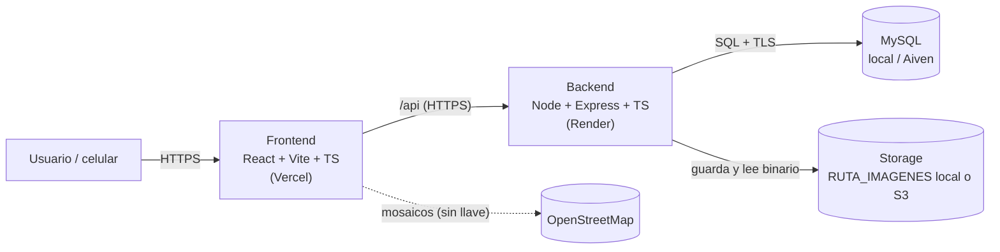

# Arquitectura

## Vista general



- El **frontend** es una SPA que consume el API. En desarrollo, Vite hace de proxy
  de `/api` hacia el backend (evita CORS y mezclar http/https).
- El **backend** valida todo, resuelve las consultas en SQL y sirve las fotos a
  través de un endpoint; nunca expone la carpeta de imágenes ni el bucket.
- La **base de datos** no se expone a internet.
- El **storage** es una abstracción con dos drivers intercambiables.

## Stack y versiones

| Capa | Tecnología | Versión |
|---|---|---|
| Runtime | Node.js | 22 LTS o superior (desarrollado con 24.14.1) |
| Gestor | npm (workspaces) | 10+ (11.11.0) |
| Frontend | React + Vite + TypeScript | React 19.3.0, Vite 8.3.0, TS 6.0.3 |
| Ruteo | react-router | 8.4.0 |
| Mapas | Leaflet + react-leaflet + OpenStreetMap | 1.9.4 / 5.0.0 |
| Estilos | Tailwind CSS (`@tailwindcss/vite`) | 4.3.3 |
| Iconos/Fuente | lucide-react / Nunito | 1.47.0 / 5.3.0 |
| Backend | Express + TypeScript | 4.22.3 / 5.9.3 |
| Datos | mysql2 (SQL crudo) | 3.24.4 |
| Validación | Zod | 3.25.76 |
| Imágenes | file-type (magic bytes) | 22.1.1 |
| Storage | @aws-sdk/client-s3 | 3.1141.0 |
| Documentación API | @asteasolutions/zod-to-openapi + swagger-ui-express | 7.3.4 / 5.0.1 |
| Pruebas | Vitest + Supertest | 2.1.9 / 7.3.0 |
| BD | MySQL | 8.0.46 (local) / Aiven |

## Estructura de carpetas

```
frontend/                      App web
  src/
    api/                       Cliente HTTP, tipos, errores, mocks
    pages/                     Mapa, lista, detalle, registro
    components/                Layout y estados
    config.ts                  Lectura de variables VITE_
backend/
  src/
    app.ts                     Construye Express (inyecta pool, storage y repositorio)
    index.ts                   Arranque (carga .env y valida config)
    config/env.ts              Esquemas Zod (loadEnv / loadDbEnv)
    db/pool.ts                 Pool mysql2 + TLS Aiven
    storage/                   StorageDriver: local, s3, validación de imagen
    schemas/perrito.ts         Esquemas Zod del dominio
    repositories/              SQL declarativo (JOIN, agregación, idempotencia)
    mappers/                   Transformaciones funcionales (row → API)
    routes/                    health, perritos
    middleware/                Errores uniformes y validación
    docs/                      Esquemas y documento OpenAPI generados
database/
  migrations/                  Esquema versionado (001..003)
  seeds/                       Catálogos y perritos de prueba
  scripts/                     migrate, seed, reset-local, backup, restore
docs/                          Esta guía, esquema de BD y despliegue
openspec/                      Specs y cambios
```

## Flujo de una petición

1. El navegador pide `GET /api/perritos/{id}/foto`.
2. Express entra por `backend/src/routes/perritos.ts`.
3. Se valida el parámetro y el repositorio (`backend/src/repositories/perritosRepository.ts`)
   consulta la ruta de la imagen con SQL.
4. El `StorageDriver` activo lee el binario (disco local o S3).
5. Se responde la imagen con su `Content-Type`; los errores pasan por el
   manejador central (`backend/src/middleware/errorHandler.ts`) con el contrato
   uniforme `{ error: { message } }`.

## Mapeo de paradigmas (dónde está cada uno)

| Paradigma | Dónde vive | Ejemplo |
|---|---|---|
| **Declarativo** | `database/migrations/`, `database/seeds/`, SQL del API, JSX/CSS | JOIN de perrito + raza + colores y `GROUP BY` en `backend/src/repositories/perritosRepository.ts` |
| **Imperativo** | Arranque y orquestación | `backend/src/app.ts`, `backend/src/index.ts`; manejadores de eventos del frontend |
| **Orientado a objetos** | Abstracción y servicios | `StorageDriver` y drivers en `backend/src/storage/`; `class HttpError` en `backend/src/middleware/errorHandler.ts`; `class ErrorApi` en `frontend/src/api/errores.ts`; componentes React |
| **Funcional** | Transformaciones sin mutación ni ciclos | `aPerritoApi` en `backend/src/mappers/perritoMapper.ts` (`find`/`filter`/`map`) y `agrupar` con `reduce` en `backend/src/repositories/perritosRepository.ts`; `aQueryString` en `frontend/src/api/http.ts` |

### SQL declarativo (JOIN y agregación)

- **JOIN:** `SELECT_PERRITO` en `backend/src/repositories/perritosRepository.ts`
  une `perros` con `razas` y con `perro_colores`/`colores` en una sola consulta,
  tanto para el listado como para el detalle.
- **Agregación:** `GET /api/estadisticas` usa `GROUP BY` para contar perritos por
  color (`estadisticasPorColor`).
- El filtrado (`busqueda`, `colorId`, `razaId`) y el orden se resuelven en SQL;
  el backend no trae todo para filtrarlo en JavaScript.

### Idempotencia

- Clave UUID generada al abrir el formulario → header `Idempotency-Key`.
- Tabla `idempotencia` (PK `idempotency_key` → `id_perro`).
- El doble envío devuelve el mismo id y el mismo resultado (no "duplicado").

## Decisiones y por qué

- **SQL crudo (mysql2) sobre ORM:** la rúbrica exige que el estilo declarativo
  (JOIN, agregación) sea visible; un ORM lo esconde.
- **OpenAPI generado desde Zod:** una sola fuente de verdad para validar y
  documentar; evita que Swagger se desincronice.
- **Abstracción de storage:** permite la instalación en vivo con disco local y el
  punto extra con S3, sin cambiar el código de los endpoints.
- **Leaflet + OpenStreetMap:** sin llave de API, un riesgo menos y nada que
  filtrar del repositorio.
