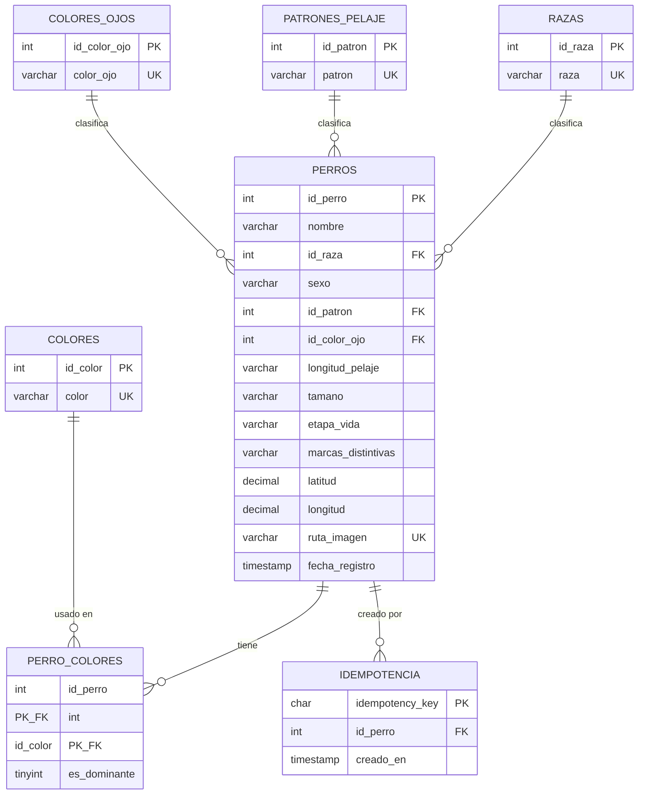

# Esquema de base de datos — Registro de perritos de la calle

Motor: MySQL 8.0+ (compatible con Aiven en la nube o instalación local con MariaDB/MySQL).
Charset/collation: `utf8mb4` / `utf8mb4_0900_ai_ci`.

## Diagrama entidad-relación

## Tablas

### Catálogos (`razas`, `colores`, `colores_ojos`, `patrones_pelaje`)
Listas de valores permitidos, referenciadas por `perros` vía FK. `razas` siempre
incluye `'Sin raza definida / Criollo'` (insertado en la migración, no en el
seed) para que todo perrito sin raza identificable se pueda registrar igual.

### `perros`
Entidad principal. Reglas de negocio aplicadas por `CHECK`:

| Constraint | Regla |
|---|---|
| `chk_nombre` | El nombre no puede ser solo espacios en blanco |
| `chk_sexo` | `'macho'` o `'hembra'` |
| `chk_pelaje` | `'corto'`, `'mediano'` o `'largo'` |
| `chk_tamano` | `'pequeño'`, `'mediano'`, `'grande'` o `'gigante'` |
| `chk_etapa` | `'cachorro'`, `'adulto'` o `'senior'` |
| `chk_latitud` / `chk_longitud` | Rango geográfico válido (-90/90, -180/180) |

Obligatorios: `nombre`, `id_raza`, `sexo`, `id_patron`, `id_color_ojo`,
`longitud_pelaje`, `tamano`, `etapa_vida`, `latitud`, `longitud` y `ruta_imagen`.
El único campo **opcional** (nullable) es `marcas_distintivas`.

`id_raza` se elige del catálogo; para "no se sabe" existe la opción
"Sin raza definida / Criollo". Migraciones: `005_campos_requeridos.sql` marca
`NOT NULL` los descriptivos y `006_raza_y_color_ojos_requeridos.sql` la raza y el
color de ojos (los registros viejos incompletos se rellenan con valores neutros).

`fecha_registro` es un `TIMESTAMP` que MySQL guarda en **UTC** y la pone el
sistema con `CURRENT_TIMESTAMP`; el cliente **no** puede fijarla (si la envía, el
backend la ignora). El backend lee con la conexión en UTC (`timezone: 'Z'` en
`backend/src/db/pool.ts`).

`ruta_imagen` es `UNIQUE` y es la clave que usa el storage del backend
(`backend/src/storage`, no una URL pública) para localizar el archivo en el
driver activo (local o S3). La imagen se sirve por el endpoint
`GET /api/perritos/{id}/foto`.

### `perro_colores`
Relación N:M entre `perros` y `colores`, con `es_dominante` marcando el color
principal. **Regla no expresable como `CHECK` en MySQL 8** (se valida en el
backend, no en la base): exactamente un `es_dominante = 1` por perrito, de 0 a
2 colores adicionales, máximo 3 colores en total, sin repetir el color
principal entre los adicionales.

### `idempotencia`
Soporte de idempotencia para el registro de perritos: guarda qué
`idempotency_key` (UUID que genera el formulario al abrirse) ya generó qué
`id_perro`, para que un reintento de red o un doble clic no duplique el
registro. La clave es la PK, así que la base rechaza cualquier duplicado.

> **Decisión:** la task mencionaba "clave de idempotencia única en `dogs`".
> Se implementó como tabla separada 1:1 (más normalizada) en lugar de una
> columna en `perros`. El endpoint de registro debe consultar/insertar aquí
> y devolver el mismo `id_perro` ante una clave repetida.

### `schema_migrations`
Tabla de control usada por `database/scripts/migrate.ts` para no reaplicar
migraciones ya corridas. No es parte del modelo de negocio.

## Archivos y cómo usarlos

| Archivo | Para qué sirve |
|---|---|
| `database/migrations/00X_*.sql` | Fuente de verdad del esquema, versionada y aplicada una por una vía `npm run db:migrate` |
| `database/seeds/00X_*.sql` | Datos de catálogo extendido y perritos de prueba, vía `npm run db:seed` |
| `database/scripts/` | `migrate.ts`, `seed.ts`, `reset-local.ts`, `backup.sh`, `restore.sh` — ver `database/scripts/README.md` |

Para levantar una base local completa desde cero: `npm run db:reset` (drop,
create, migrate y seed). Es la única ruta soportada; no hay archivo único de
reconstrucción que pueda desincronizarse.

## Validación

Las migraciones y seeds fueron probados de punta a punta contra un
MySQL/MariaDB limpio: crean las tablas, cargan 26 razas, 12 colores, 6 colores
de ojos, 18 patrones y 16 perritos de prueba con sus colores, y las
restricciones (`chk_nombre`, `chk_latitud`, `chk_longitud`, FKs) rechazan datos
inválidos. `db:seed` genera además una foto PNG válida por cada perrito de
prueba dentro de `RUTA_IMAGENES` (modo local), para cumplir "con foto" sin
versionar archivos pesados.
