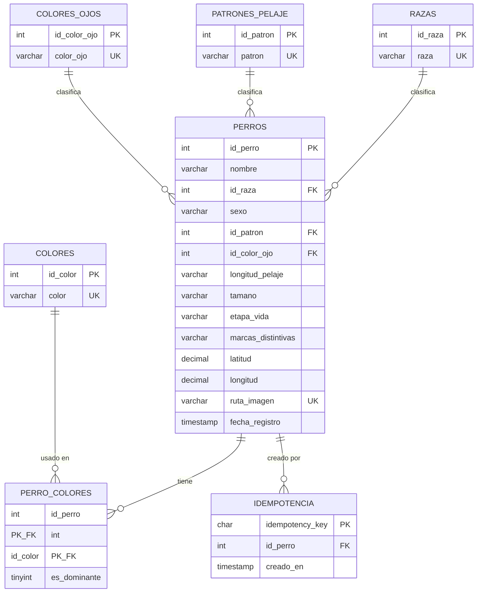

# Esquema de base de datos — Registro de perritos de la calle

Motor: MySQL 8.0+ (compatible con Aiven en la nube o instalación local con MariaDB/MySQL).
Charset/collation: `utf8mb4` / `utf8mb4_0900_ai_ci`.

## Diagrama entidad-relación

## Tablas

### Catálogos (`razas`, `colores`, `colores_ojos`, `patrones_pelaje`)
Listas de valores permitidos, referenciadas por `perros` vía FK. `razas` siempre
incluye `'Sin raza definida / Criollo'` (insertado en la migración, no en el
seed) para que todo perrito sin raza identificable se pueda registrar igual.

### `perros`
Entidad principal. Reglas de negocio aplicadas por `CHECK`:

| Constraint | Regla |
|---|---|
| `chk_nombre` | El nombre no puede ser solo espacios en blanco |
| `chk_sexo` | `'macho'` o `'hembra'` |
| `chk_pelaje` | `'corto'`, `'mediano'` o `'largo'` |
| `chk_tamano` | `'pequeño'`, `'mediano'`, `'grande'` o `'gigante'` |
| `chk_etapa` | `'cachorro'`, `'adulto'` o `'senior'` |
| `chk_latitud` / `chk_longitud` | Rango geográfico válido (-90/90, -180/180) |

`ruta_imagen` es `UNIQUE` y es la clave que usa `src/storage` (no una URL
pública) para localizar el archivo en el driver activo (local o S3).

### `perro_colores`
Relación N:M entre `perros` y `colores`, con `es_dominante` marcando el color
principal. **Regla no expresable como `CHECK` en MySQL 8** (se valida en el
backend, no en la base): exactamente un `es_dominante = 1` por perrito, de 0 a
2 colores adicionales, máximo 3 colores en total, sin repetir el color
principal entre los adicionales.

### `idempotencia`
Soporte de idempotencia para `POST /perros`: guarda qué `idempotency_key` ya
generó qué `id_perro`, para que un reintento de red no duplique el registro.

> **Nota de diseño:** la task original pedía "clave de idempotencia única en
> `dogs`", lo que sugiere una columna en la tabla principal. Aquí se
> implementó como tabla separada (equivalente, más normalizada). Confirmar
> con el equipo de backend antes de construir lógica que asuma una u otra.

### `schema_migrations`
Tabla de control usada por `database/scripts/migrate.ts` para no reaplicar
migraciones ya corridas. No es parte del modelo de negocio.

## Archivos y cómo usarlos

| Archivo | Para qué sirve |
|---|---|
| `database/migrations/00X_*.sql` | Fuente de verdad del esquema, versionada y aplicada una por una vía `npm run db:migrate` |
| `database/seeds/00X_*.sql` | Datos de catálogo extendido y perritos de prueba, vía `npm run db:seed` |
| `database/full_reconstruction.sql` | Copia de conveniencia: migraciones + seeds en un solo archivo, para levantar una base local completa con un solo `mysql < archivo.sql`, sin depender de Node. **No es la fuente de verdad**: si cambian las migraciones o seeds, hay que regenerar este archivo. |
| `database/scripts/` | `migrate.ts`, `seed.ts`, `backup.sh`, `restore.sh`, `reset-local.sh` — ver `database/scripts/README.md` |

## Validación

`full_reconstruction.sql` fue probado de punta a punta contra un MySQL/MariaDB
limpio: crea las 8 tablas, carga 26 razas, 12 colores, 6 colores de ojos, 18
patrones, 16 perritos de prueba con sus colores, y las restricciones
(`chk_nombre`, `chk_latitud`, `chk_longitud`, FKs) rechazan correctamente
datos inválidos.
