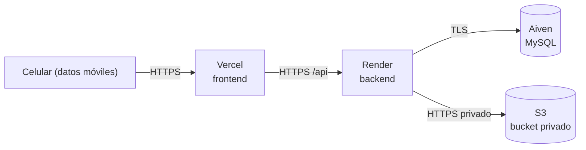

# Despliegue

Cómo se publica PawFinder en internet (punto extra) y cómo se administra el
servicio sin Docker. Aplica la regla clave: **las imágenes no viven junto al
código** y **la base de datos no se expone**.

## 1. Dónde corre cada pieza

| Pieza | Servicio | Notas |
|---|---|---|
| Aplicación web | **Vercel** | Build estático de Vite; entrega dominio y HTTPS. |
| API REST | **Render** | Servicio Node; entrega dominio y HTTPS. |
| Base de datos | **Aiven** (MySQL) | Acceso **solo** desde el API, con TLS. |
| Imágenes | **AWS S3** (bucket privado) | Se leen por el endpoint del backend, nunca enlace público directo. |



El **directorio de imágenes** (modo local) o el **bucket** (S3) siguen fuera del
código: no se sirven como carpeta estática ni se montan junto a los binarios.

## 2. Dominio y HTTPS

- **Vercel** y **Render** entregan un subdominio `*.vercel.app` / `*.onrender.com`
  con **certificado TLS automático**. Para un dominio propio se agrega en el panel
  de cada servicio (CNAME/A → servicio) y el certificado se emite solo.
- HTTPS **no es opcional**: sin él el navegador no da cámara ni ubicación.
- En la auto-hospedada, el certificado lo emite **Caddy** automáticamente o
  **nginx + Let's Encrypt** (certbot).

## 3. Qué cambia entre local y producción (variable por variable)

| Variable | Local | Producción |
|---|---|---|
| `NODE_ENV` | `development` | `production` |
| `PORT` | `3000` | El que asigne Render (`process.env.PORT`) |
| `CORS_ORIGIN` | `http://localhost:5173` | `https://pawfinder.vercel.app` (o dominio propio) |
| `DB_HOST` / `DB_PORT` | `localhost` / `3306` | host y puerto de Aiven |
| `DB_USER` / `DB_PASSWORD` | usuario local / vacío | `avnadmin` / secreto de Aiven |
| `DB_NAME` | `pawfinder` | `defaultdb` (o la base creada en Aiven) |
| `DB_SSL` / `DB_SSL_CA` | `false` / vacío | `true` / PEM de Aiven (ruta o entre comillas) |
| `STORAGE_DRIVER` | `local` | `s3` |
| `RUTA_IMAGENES` | carpeta fuera del repo | no aplica (S3) |
| `AWS_REGION` / `AWS_S3_BUCKET` / `AWS_ACCESS_KEY_ID` / `AWS_SECRET_ACCESS_KEY` | — | datos del bucket y credenciales IAM |
| `PUBLIC_BASE_URL` / `OPENAPI_SERVER_URL` | `http://localhost:3000` | `https://api-pawfinder.onrender.com` |
| `VITE_API_URL` (frontend) | `/api` (proxy de Vite) | URL del backend en Render |

### Dónde se guardan las contraseñas

- En el **panel de variables de entorno** de Render (backend), de Vercel
  (frontend) y de Aiven (base). Nunca en el repositorio.
- Los secretos se configuran como *environment variables* del servicio; el
  repositorio solo contiene `backend/.env.example` y `frontend/.env.example`.

## 4. Puertos

| Servicio | Puerto público | Expuesto a internet |
|---|---|---|
| Frontend (Vercel) | 443 | Sí |
| Backend (Render) | 443 (Render enruta al `PORT`) | Sí |
| MySQL (Aiven) | — | **No** (solo el backend con TLS) |
| Storage (S3) | 443 | Solo por SDK con credenciales; bucket privado |

La **base de datos no se expone**: en Aiven se restringe el acceso y, si se
auto-hospeda, el puerto 3306 se cierra al exterior.

## 5. Respaldos y restauración

### Base de datos

```bash
npm run db:backup                                   # genera database/backups/<db>_<fecha>.sql.gz
npm run db:restore -- database/backups/archivo.sql.gz
```

- `backup.sh` usa `mysqldump` (con `--single-transaction`) y funciona contra
  local o Aiven (aplica TLS si `DB_SSL=true`).
- `restore.sh` pide confirmación antes de sobrescribir.

### Imágenes

- **S3:** activar *versionado* del bucket y/o *replicación*/reglas de ciclo de
  vida; respaldar con `aws s3 sync s3://bucket ./respaldo`.
- **Local:** copiar el contenido de `RUTA_IMAGENES` a otro disco/almacenamiento.
- Restaurar es copiar de vuelta al bucket o a `RUTA_IMAGENES`.

## 6. Instalación sin Docker (auto-hospedada)

La consigna **prohíbe Docker**. En un servidor (por ejemplo, una VM Linux) la
instalación es directa:

1. Instalar **Node.js 22+** y **MySQL 8** (o usar Aiven).
2. Clonar el repo, `npm install`, configurar `backend/.env` y `frontend/.env`.
3. `npm run build --workspace @pawfinder/backend` y
   `npm run build --workspace @pawfinder/frontend`.
4. Servicio administrado por **systemd** (revive solo). Ejemplo mínimo:

   ```ini
   # /etc/systemd/system/pawfinder-api.service
   [Unit]
   Description=PawFinder API
   After=network.target

   [Service]
   WorkingDirectory=/opt/pawfinder/backend
   EnvironmentFile=/opt/pawfinder/backend/.env
   ExecStart=/usr/bin/node dist/index.js
   Restart=always
   User=pawfinder

   [Install]
   WantedBy=multi-user.target
   ```

   ```bash
   sudo systemctl enable --now pawfinder-api
   ```

5. **Proxy inverso** al frente: **Caddy** (certificado automático) o
   **nginx + certbot**. Caddy apunta al `PORT` del backend y sirve el build del
   frontend.

   ```
   api.pawfinder.example.com {
     reverse_proxy 127.0.0.1:3000
   }
   ```

## 7. Checklist de publicación

- [ ] Base creada en Aiven; `DB_SSL=true` con el PEM de la CA.
- [ ] Backend desplegado en Render con las variables de producción.
- [ ] Frontend desplegado en Vercel apuntando `VITE_API_URL` al backend.
- [ ] `CORS_ORIGIN` del backend = dominio del frontend.
- [ ] Bucket S3 privado + credenciales IAM en Render.
- [ ] `PUBLIC_BASE_URL` y `OPENAPI_SERVER_URL` con la URL pública.
- [ ] `GET /api/health` responde 200 en la URL pública.
- [ ] Registrar un perrito desde un **celular con datos móviles** (prueba real).
- [ ] Poner aquí la **URL pública**: _pendiente_.

> Recuerda: un túnel (Cloudflare Tunnel, ngrok, Tailscale Funnel) sirve como
> alternativa para la demo, pero la liga cambia o se cae al cerrar la sesión.
> Prueba la URL desde otro dispositivo antes de presentar.
