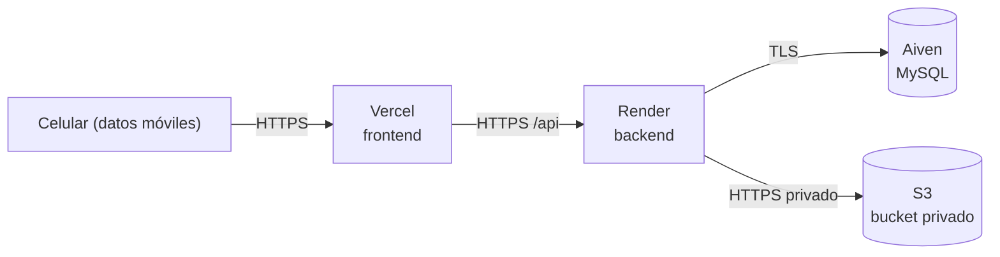

# Despliegue

Cómo se publica PawFinder en internet (punto extra) y cómo se administra el
servicio sin Docker. Aplica la regla clave: **las imágenes no viven junto al
código** y **la base de datos no se expone**.

## 1. Dónde corre cada pieza

| Pieza | Servicio | Notas |
|---|---|---|
| Aplicación web | **Vercel** | Build estático de Vite; entrega dominio y HTTPS. |
| API REST | **Render** | Servicio Node; entrega dominio y HTTPS. |
| Base de datos | **Aiven** (MySQL) | Acceso **solo** desde el API, con TLS. |
| Imágenes | **AWS S3** (bucket privado) | Se leen por el endpoint del backend, nunca enlace público directo. |



El **directorio de imágenes** (modo local) o el **bucket** (S3) siguen fuera del
código: no se sirven como carpeta estática ni se montan junto a los binarios.

## 2. Dominio y HTTPS

- **Vercel** y **Render** entregan un subdominio `*.vercel.app` / `*.onrender.com`
  con **certificado TLS automático**. Para un dominio propio se agrega en el panel
  de cada servicio (CNAME/A → servicio) y el certificado se emite solo.
- HTTPS **no es opcional**: sin él el navegador no da cámara ni ubicación.
- En la auto-hospedada, el certificado lo emite **Caddy** automáticamente o
  **nginx + Let's Encrypt** (certbot).

## 3. Qué cambia entre local y producción (variable por variable)

| Variable | Local | Producción |
|---|---|---|
| `NODE_ENV` | `development` | `production` |
| `PORT` | `3000` | El que asigne Render (`process.env.PORT`) |
| `CORS_ORIGIN` | `http://localhost:5173` | `https://pawfinder.vercel.app` (o dominio propio) |
| `DB_HOST` / `DB_PORT` | `localhost` / `3306` | host y puerto de Aiven |
| `DB_USER` / `DB_PASSWORD` | usuario local / vacío | `avnadmin` / secreto de Aiven |
| `DB_NAME` | `pawfinder` | `defaultdb` (o la base creada en Aiven) |
| `DB_SSL` / `DB_SSL_CA` | `false` / vacío | `true` / PEM de Aiven (ruta o entre comillas) |
| `STORAGE_DRIVER` | `local` | `s3` |
| `RUTA_IMAGENES` | carpeta fuera del repo | no aplica (S3) |
| `AWS_REGION` / `AWS_S3_BUCKET` / `AWS_ACCESS_KEY_ID` / `AWS_SECRET_ACCESS_KEY` | — | datos del bucket y credenciales IAM |
| `PUBLIC_BASE_URL` / `OPENAPI_SERVER_URL` | `http://localhost:3000` | `https://api-pawfinder.onrender.com` |
| `VITE_API_URL` (frontend) | `/api` (proxy de Vite) | URL del backend en Render |

### Dónde se guardan las contraseñas

- En el **panel de variables de entorno** de Render (backend), de Vercel
  (frontend) y de Aiven (base). Nunca en el repositorio.
- Los secretos se configuran como *environment variables* del servicio; el
  repositorio solo contiene `backend/.env.example` y `frontend/.env.example`.

## 4. Puertos

| Servicio | Puerto público | Expuesto a internet |
|---|---|---|
| Frontend (Vercel) | 443 | Sí |
| Backend (Render) | 443 (Render enruta al `PORT`) | Sí |
| MySQL (Aiven) | — | **No** (solo el backend con TLS) |
| Storage (S3) | 443 | Solo por SDK con credenciales; bucket privado |

La **base de datos no se expone**: en Aiven se restringe el acceso y, si se
auto-hospeda, el puerto 3306 se cierra al exterior.

## 5. Crear el bucket S3 paso a paso (AWS CLI)

Esta guía crea el bucket privado, un usuario de aplicación con permiso mínimo y
las credenciales que usa el backend. Todo se hace desde la terminal con **AWS CLI
v2**, sin Docker.

### 5.1 Instalar AWS CLI y abrir la línea de comandos

La CLI no es una consola aparte: se instala una vez y luego se ejecutan comandos
`aws ...` desde la terminal que ya usas (PowerShell, Terminal, bash).

- **Windows (PowerShell):** `winget install Amazon.AWSCLI` o el instalador MSI
  oficial.
- **macOS:** `brew install awscli`.
- **Linux:**
  `curl "https://awscli.amazonaws.com/awscli-exe-linux-x86_64.zip" -o awscliv2.zip && unzip awscliv2.zip && sudo ./aws/install`.

Abre una terminal nueva y comprueba:

```bash
aws --version
```

> Los comandos de esta guía van en **una sola línea** para que funcionen igual
> en PowerShell y en bash. Si necesitas partirlos, la continuación de línea es
> **backtick** `` ` `` en PowerShell y **`\`** en bash/macOS/Linux.

#### 5.1.1 El prompt de "AWS skills y MCP" del instalador (opcional)

Al terminar de instalar, el instalador puede preguntar:

```text
Configure AWS skills and the AWS MCP server for your AI coding agent(s)? [y/n/never]:
```

Es una función para asistentes de código con IA, **no afecta al backend ni al
despliegue**:

- `y` → intenta configurar el MCP de AWS y sus "skills" en los agentes que
  detecte (Kiro, Cursor, VS Code, Claude Code, etc.).
- `n` → no configurarlo ahora (preguntará de nuevo en una futura actualización).
- `never` → no volver a preguntar.

Para esta guía **no hace falta**: los comandos de §5.3–§5.8 usan el CLI `aws`
normal, así que puedes responder `n` o `never` sin problema.

Si **sí** quieres que tu asistente consulte AWS (documentación, recursos,
etc.), configura el **AWS MCP Server** remoto a través de un proxy local.
Necesitas `uv` (`winget install astral-sh.uv`, `brew install uv` o
`pip install uv`). Ejemplo para **opencode** en `opencode.json` (en la raíz del
proyecto o en `~/.config/opencode/`):

```json
{
  "$schema": "https://opencode.ai/config.json",
  "mcp": {
    "aws": {
      "type": "local",
      "command": ["uvx", "mcp-proxy-for-aws@latest", "https://aws-mcp.us-east-1.api.aws/mcp"]
    }
  }
}
```

Como alternativa sin credenciales, el **AWS Knowledge MCP** (solo documentación)
se puede conectar como servidor remoto:

```json
{
  "mcp": {
    "aws-knowledge": { "type": "remote", "url": "https://knowledge-mcp.global.api.aws" }
  }
}
```

Otros clientes tienen botones de instalación en
<https://github.com/awslabs/mcp>. Reinicia el agente después de cambiar la
configuración. AWS está migrando estos servidores a **Agent Toolkit for AWS**,
pero `awslabs/mcp` sigue funcionando.

### 5.2 Credenciales para operar (una sola vez)

`aws configure` necesita credenciales de una cuenta con permiso para crear
recursos. No uses la cuenta root para esto:

1. Entra a <https://console.aws.amazon.com> e inicia sesión con tu cuenta. En la
   barra superior busca y abre **IAM**.
2. En el menú lateral: **Users → Create user**. Nombre `pawfinder-admin` → Next.
3. En **Set permissions** elige **Attach policies directly**, busca
   `AdministratorAccess`, márcala → Next → **Create user**. (No marques acceso a
   la consola: este usuario es solo para la CLI.)
4. Se abre la lista de usuarios; haz clic en **`pawfinder-admin`** para entrar a
   su página de detalle.
5. Dentro del usuario, abre la pestaña **Security credentials**.
6. Baja hasta la sección **Access keys** y pulsa **Create access key**.
7. Elige el caso de uso **Command Line Interface (CLI)**, marca la confirmación
   → Next → (descripción opcional) → **Create access key**.
8. Ahí aparecen las dos credenciales:
   - **Access key ID**: empieza con `AKIA...`
   - **Secret access key**: la cadena larga

   Cópialas en ese momento (botón **Download .csv** o el ícono de copiar). El
   **Secret access key solo se muestra esta vez**; si lo pierdes, hay que crear
   otra llave.
9. **Done**.

Esas dos cadenas del paso 8 son las que pides en los dos primeros campos de
`aws configure`.

Configura la CLI (pide cuatro datos):

```bash
aws configure
# AWS Access Key ID [None]: AKIA...
# AWS Secret Access Key [None]: ********
# Default region name [None]: us-east-1
# Default output format [None]: json
```

Los datos quedan en `~/.aws/credentials` y `~/.aws/config` (Windows:
`C:\Users\<usuario>\.aws\`), **fuera del repositorio**. Comprueba la identidad:

```bash
aws sts get-caller-identity
```

Si usas varios perfiles: `aws configure --profile pawfinder-admin` y agrega
`--profile pawfinder-admin` (o `AWS_PROFILE=pawfinder-admin`) a los comandos.

### 5.3 Crear el bucket privado

El nombre es único a nivel global (no puede llevar mayúsculas ni `_`), así que
usa un nombre del proyecto, **sin nombres de personas**; si `pawfinder-imagenes`
ya está tomado, agrega un sufijo neutral (p. ej. `pawfinder-imagenes-2026`). En
`us-east-1` no hace falta nada extra:

```bash
aws s3api create-bucket --bucket pawfinder-imagenes --region us-east-1
```

En otra región hay que declarar `LocationConstraint`:

```bash
aws s3api create-bucket --bucket pawfinder-imagenes --region us-west-2 --create-bucket-configuration LocationConstraint=us-west-2
```

**¿Qué es `LocationConstraint`?** Es un requisito de la API de S3. La firma
original de `CreateBucket` no incluía la región: `us-east-1` era el valor
predeterminado y por eso se puede omitir. Para crear el bucket en **cualquier
otra región** hay que indicárselo explícitamente con `LocationConstraint`, o el
comando falla con `IllegalLocationConstraintException`. En resumen: si tu región
es `us-east-1`, omítelo; si no, repite la región ahí.

### 5.4 Bloquear el acceso público, cifrar y versionar

```bash
aws s3api put-public-access-block --bucket pawfinder-imagenes --public-access-block-configuration "BlockPublicAcls=true,IgnorePublicAcls=true,BlockPublicPolicy=true,RestrictPublicBuckets=true"

aws s3api put-bucket-versioning --bucket pawfinder-imagenes --versioning-configuration Status=Enabled
```

Para el cifrado, el JSON de configuración se pasa en un **archivo** con
`file://`. Así se evita el infierno de escapar comillas (en PowerShell `\"` no
funciona como en bash). Crea `pawfinder-s3-encryption.json` (fuera del repo):

```json
{
  "Rules": [
    { "ApplyServerSideEncryptionByDefault": { "SSEAlgorithm": "AES256" } }
  ]
}
```

Y aplícalo:

```bash
aws s3api put-bucket-encryption --bucket pawfinder-imagenes --server-side-encryption-configuration file://pawfinder-s3-encryption.json
```

El versionado permite recuperar una imagen borrada por error (ver §6).

#### 5.4.1 Restringir los tipos de archivo permitidos (opcional)

La validación **real** ya la hace el backend por **contenido** (magic bytes, no
la extensión ni el `Content-Type`) en `backend/src/storage/validateImage.ts`, y
solo acepta **JPG, PNG y WEBP**. Además, como capa extra en el propio bucket, se
puede añadir una *bucket policy* que rechace cualquier `PutObject` cuyo
`Content-Type` no sea uno de esos tres (el driver del backend siempre lo
declara, `backend/src/storage/s3Driver.ts`).

Crea `pawfinder-s3-contenttype-policy.json` (fuera del repo) con:

```json
{
  "Version": "2012-10-17",
  "Statement": [{
    "Sid": "SoloImagenesPermitidas",
    "Effect": "Deny",
    "Principal": "*",
    "Action": "s3:PutObject",
    "Resource": "arn:aws:s3:::pawfinder-imagenes/*",
    "Condition": {
      "StringNotEquals": {
        "s3:ContentType": ["image/jpeg", "image/png", "image/webp"]
      }
    }
  }]
}
```

Y aplícala:

```bash
aws s3api put-bucket-policy --bucket pawfinder-imagenes --policy file://pawfinder-s3-contenttype-policy.json
```

Notas:
- S3 no puede condicionar por extensión del nombre (`s3:KeySuffix` no existe);
  lo que se puede condicionar es el `Content-Type` declarado.
- El `Content-Type` lo declara el cliente, así que esto **no** sustituye la
  validación por magic bytes del backend: es defensa en profundidad.
- Aplica a **todos** los que escriban en el bucket (incluido tu admin), por eso
  `aws s3 cp`/`sync` también deben mandar un `Content-Type` válido.

### 5.5 Usuario de aplicación con permiso mínimo

El backend solo necesita leer y escribir objetos de ese bucket. Crea un archivo
`pawfinder-s3-policy.json` (fuera del repositorio o en una carpeta temporal):

```json
{
  "Version": "2012-10-17",
  "Statement": [{
    "Effect": "Allow",
    "Action": ["s3:PutObject", "s3:GetObject"],
    "Resource": "arn:aws:s3:::pawfinder-imagenes/*"
  }]
}
```

Crea el usuario, la política, asígnala y genera su llave:

```bash
aws iam create-user --user-name pawfinder-s3

aws iam create-policy --policy-name PawFinderS3 --policy-document file://pawfinder-s3-policy.json

# Sustituye <ACCOUNT_ID> por: aws sts get-caller-identity --query Account --output text
aws iam attach-user-policy --user-name pawfinder-s3 --policy-arn arn:aws:iam::<ACCOUNT_ID>:policy/PawFinderS3

aws iam create-access-key --user-name pawfinder-s3
```

Guarda el `AccessKeyId` y el `SecretAccessKey` del último comando: son las
credenciales del backend.

### 5.6 Conectar el backend

En `backend/.env` (local) y en las **variables de entorno de Render**
(producción), nunca en el repositorio:

```env
STORAGE_DRIVER=s3
AWS_REGION=us-east-1
AWS_S3_BUCKET=pawfinder-imagenes
AWS_ACCESS_KEY_ID=AKIA...          # del usuario pawfinder-s3
AWS_SECRET_ACCESS_KEY=...          # del usuario pawfinder-s3
```

`RUTA_IMAGENES` deja de usarse. Si falta alguna variable de AWS, el backend no
arranca (validación en `backend/src/config/env.ts`).

### 5.7 Verificar

```bash
aws s3 ls s3://pawfinder-imagenes/            # vacío al inicio
```

Prueba de permisos con las credenciales de la aplicación (perfil aparte):

```bash
aws configure --profile pawfinder-app             # usa las llaves de pawfinder-s3
echo hola > prueba.txt
aws s3 cp prueba.txt s3://pawfinder-imagenes/ --profile pawfinder-app
aws s3 rm s3://pawfinder-imagenes/prueba.txt --profile pawfinder-app
```

Desde la app: reinicia el backend, registra un perrito con foto y comprueba que
aparece un objeto `<uuid>.<ext>` en el bucket y que
`GET /api/perritos/{id}/foto` devuelve la imagen.

### 5.8 Respaldar y restaurar las imágenes

```bash
aws s3 sync s3://pawfinder-imagenes ./respaldo-imagenes
aws s3 sync ./respaldo-imagenes s3://pawfinder-imagenes
```

Para deshacer todo (opcional): vaciar y eliminar el bucket, y desasignar la
política del usuario.

## 6. Respaldos y restauración

### Base de datos

```bash
npm run db:backup                                   # genera database/backups/<db>_<fecha>.sql.gz
npm run db:restore -- database/backups/archivo.sql.gz
```

- `backup.sh` usa `mysqldump` (con `--single-transaction`) y funciona contra
  local o Aiven (aplica TLS si `DB_SSL=true`).
- `restore.sh` pide confirmación antes de sobrescribir.

### Imágenes

- **S3:** activar *versionado* del bucket y/o *replicación*/reglas de ciclo de
  vida; respaldar con `aws s3 sync s3://bucket ./respaldo`.
- **Local:** copiar el contenido de `RUTA_IMAGENES` a otro disco/almacenamiento.
- Restaurar es copiar de vuelta al bucket o a `RUTA_IMAGENES`.

## 7. Instalación sin Docker (auto-hospedada)

La consigna **prohíbe Docker**. En un servidor (por ejemplo, una VM Linux) la
instalación es directa:

1. Instalar **Node.js 22+** y **MySQL 8** (o usar Aiven).
2. Clonar el repo, `npm install`, configurar `backend/.env` y `frontend/.env`.
3. `npm run build --workspace @pawfinder/backend` y
   `npm run build --workspace @pawfinder/frontend`.
4. Servicio administrado por **systemd** (revive solo). Ejemplo mínimo:

   ```ini
   # /etc/systemd/system/pawfinder-api.service
   [Unit]
   Description=PawFinder API
   After=network.target

   [Service]
   WorkingDirectory=/opt/pawfinder/backend
   EnvironmentFile=/opt/pawfinder/backend/.env
   ExecStart=/usr/bin/node dist/index.js
   Restart=always
   User=pawfinder

   [Install]
   WantedBy=multi-user.target
   ```

   ```bash
   sudo systemctl enable --now pawfinder-api
   ```

5. **Proxy inverso** al frente: **Caddy** (certificado automático) o
   **nginx + certbot**. Caddy apunta al `PORT` del backend y sirve el build del
   frontend.

   ```
   api.pawfinder.example.com {
     reverse_proxy 127.0.0.1:3000
   }
   ```

## 8. Checklist de publicación

- [ ] Base creada en Aiven; `DB_SSL=true` con el PEM de la CA.
- [ ] Backend desplegado en Render con las variables de producción.
- [ ] Frontend desplegado en Vercel apuntando `VITE_API_URL` al backend.
- [ ] `CORS_ORIGIN` del backend = dominio del frontend.
- [ ] Bucket S3 privado + credenciales IAM en Render.
- [ ] `PUBLIC_BASE_URL` y `OPENAPI_SERVER_URL` con la URL pública.
- [ ] `GET /api/health` responde 200 en la URL pública.
- [ ] Registrar un perrito desde un **celular con datos móviles** (prueba real).
- [ ] Poner aquí la **URL pública**: _pendiente_.

> Recuerda: un túnel (Cloudflare Tunnel, ngrok, Tailscale Funnel) sirve como
> alternativa para la demo, pero la liga cambia o se cae al cerrar la sesión.
> Prueba la URL desde otro dispositivo antes de presentar.
