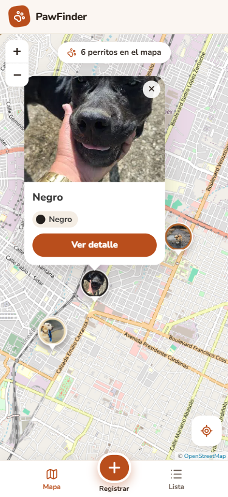
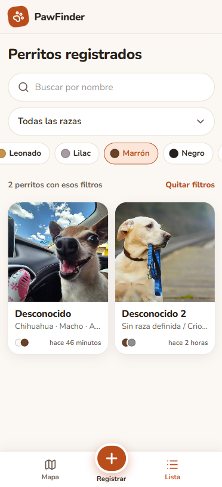
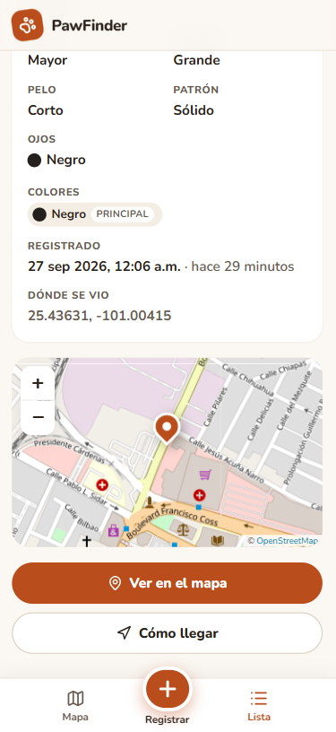
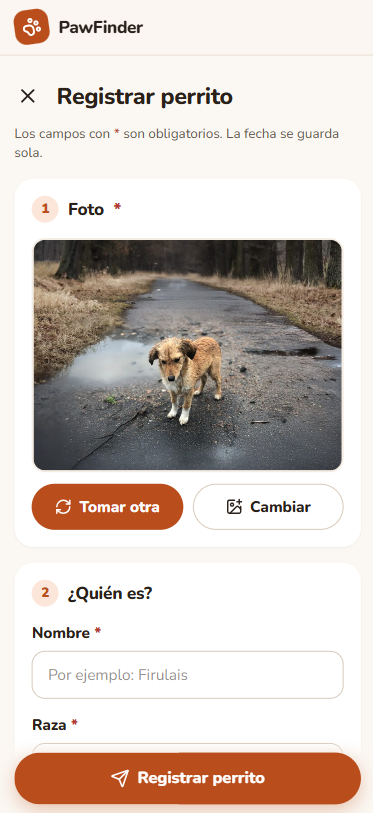
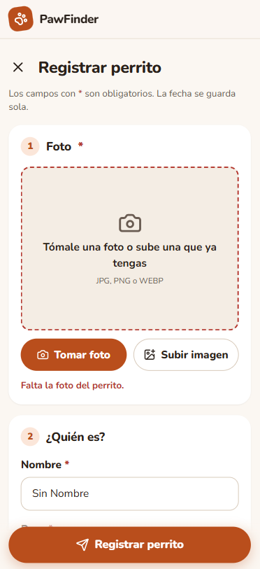

# PawFinder · Frontend

Interfaz web para registrar perritos de la calle: foto, nombre, raza, sexo, edad, tamaño, pelo, colores,
ojos, marcas distintivas y ubicación en el mapa.
Pensada primero para celular (se usa en la calle) y adaptada a computadora.

> Este documento cubre sólo el frontend. El `README.md` de la raíz del repositorio es el oficial
> del proyecto; de aquí se pueden copiar las secciones del frontend.
> Las respuestas del backend llegan como `{ data }` y los errores como `{ error: { message, details } }`
> (ver `openspec/changes/bootstrap-project/design.md` y Swagger en `/api/docs`).

## Tecnologías y versiones exactas

| Pieza | Versión | Para qué |
|---|---|---|
| Node.js | 22.22.2 (LTS; cualquier ≥ 22.12 funciona, también 24 LTS) | Correr las herramientas |
| npm | 10.9 o 11 (viene con Node) | Instalar dependencias |
| TypeScript | 6.0.3 | Lenguaje |
| React / React DOM | 19.3.0 | Interfaz |
| React Router | 8.4.0 | Pantallas y URLs |
| Vite | 8.3.0 | Servidor de desarrollo y compilación |
| Tailwind CSS (+ `@tailwindcss/vite`) | 4.3.3 | Estilos con clases utilitarias |
| Leaflet / React Leaflet | 1.9.4 / 5.0.0 | Mapa (mosaicos de OpenStreetMap con respaldo automático, **sin llave de API**) |
| lucide-react | 1.47.0 | Íconos |
| @fontsource-variable/nunito | 5.3.0 | Tipografía (incluida en el proyecto, no depende de internet) |
| Vitest | 5.0.2 | Pruebas |
| oxlint | 1.85.0 | Revisión de estilo de código |

Las versiones están fijas en `package.json` (sin `^`) y en el `package-lock.json` **de la raíz**. No se usa Docker.

## Instalación

El repositorio es un monorepo con *npm workspaces* (`frontend`, `backend`, `database`): hay un solo
`package-lock.json`, en la raíz, y las dependencias se instalan desde ahí.

```bash
# en la raíz del repositorio
npm ci
```

> **Windows con PowerShell:** si aparece *"npm.ps1 cannot be loaded because running scripts is disabled
> on this system"*, usar `npm.cmd` en lugar de `npm` (`npm.cmd ci`, `npm.cmd run dev`) o abrir la
> terminal **cmd** (Símbolo del sistema), donde `npm` funciona normal.
>
> Si en cambio dice que `npm` **"no se reconoce"** como comando, Node.js no está en el `PATH`:
> cierra todas las terminales y abre una nueva (o reinicia Windows); si persiste, ver la sección
> 3.1 del [README principal](../README.md).

Copiar la configuración de ejemplo:

```bash
# Linux / macOS / Git Bash
cp .env.example .env.local
# Windows (cmd o PowerShell)
copy .env.example .env.local
```

El archivo `.env.local` va dentro de `frontend/`.

## Ejecutar

```bash
# desde la raíz
npm run dev:frontend
# o desde frontend/
npm run dev
```

Abre <http://localhost:5173>.

La app **necesita el backend** para mostrar datos: sin él, cada pantalla muestra
"No pudimos conectar con el servidor" con un botón para reintentar.

### Conectarlo con el backend

1. Levantar el backend (`npm run dev:backend` desde la raíz).
2. En `frontend/.env.local`, `BACKEND_URL` con la dirección del backend (por defecto `http://localhost:3000`).
3. Reiniciar el servidor del frontend.

El navegador siempre pide a `/api/...` y Vite reenvía esas peticiones a `BACKEND_URL` (proxy).
Por eso **el backend debe exponer todos sus endpoints bajo `/api`** y no hace falta configurar CORS
en desarrollo.

## Configuración

| Variable | Ejemplo | Qué hace |
|---|---|---|
| `VITE_API_URL` | `/api` | URL base de la API vista desde el navegador. Dejarla en `/api`. |
| `BACKEND_URL` | `http://localhost:3000` | A dónde reenvía el proxy de Vite las peticiones `/api`. Sólo lo lee `vite.config.ts`. |
| `VITE_MAPA_CENTRO` | `19.4326,-99.1332` | Centro inicial del mapa (latitud,longitud). |
| `VITE_MAPA_ZOOM` | `13` | Zoom inicial del mapa. |
| `VITE_MAPA_MOSAICOS_URL` | _(vacío)_ | Opcional. Otro proveedor de mapas; vacío = OpenStreetMap. |
| `VITE_MAPA_MOSAICOS_CREDITOS` | _(vacío)_ | Opcional. Créditos que exige ese proveedor. |

El frontend no guarda contraseñas ni llaves: todo lo que empieza con `VITE_` termina visible en el navegador.

## Probarlo desde un celular en la misma red

El navegador sólo da **cámara y ubicación** en `https` o en `localhost`. Desde el celular no es
`localhost`, así que hay un modo con HTTPS:

```bash
npm run dev:red
```

1. La terminal muestra algo como `Network: https://192.168.1.50:5173/`. Abrir esa dirección en el celular
   (celular y computadora en la **misma red Wi-Fi**).
2. El navegador avisará que el certificado no es de confianza (es autofirmado): elegir
   *Avanzado → Continuar*. Es normal en desarrollo.
3. Si no carga: en Windows, permitir a Node.js en el Firewall cuando lo pregunte (redes privadas).

El backend puede quedarse en `localhost` de la computadora: el celular sólo habla con Vite y Vite
le reenvía las peticiones.

## Mapa: de dónde salen las imágenes

| Proveedor | ¿Llave? | Uso en la app |
|---|---|---|
| OpenStreetMap (`tile.openstreetmap.org`) | No | Principal. Exige créditos visibles y que el navegador envíe de qué sitio viene la petición (ya configurado). |
| OSM Francia, estilo humanitario (`tile.openstreetmap.fr/hot`) | No | Respaldo automático: si el principal no carga (servidor caído o red que lo bloquea), el mapa cambia solo. |

Funciona igual en computadora y en celular, incluido el modo `npm run dev:red` con HTTPS.

Si algún día se necesita otro proveedor (por ejemplo MapTiler o Stadia Maps, que piden cuenta gratuita),
se pone su URL en `VITE_MAPA_MOSAICOS_URL` y sus créditos en `VITE_MAPA_MOSAICOS_CREDITOS` dentro de
`.env.local`; si la URL lleva llave, **no se sube al repositorio**. No se recomienda CARTO: sus mapas de este
tipo ahora piden llave y los están retirando.

## Scripts

| Comando | Qué hace |
|---|---|
| `npm run dev` | Servidor de desarrollo en <http://localhost:5173> |
| `npm run dev:red` | Igual, con HTTPS y accesible desde otros dispositivos de la red |
| `npm run build` | Revisa tipos y genera la versión de producción en `dist/` |
| `npm run preview` | Sirve `dist/` para probar la versión de producción |
| `npm test` | Pruebas de las reglas de validación |
| `npm run lint` | Revisión de código |
| `npm run typecheck` | Sólo revisión de tipos |

## Producción

`npm run build` genera archivos estáticos en `dist/`. En el servidor, el proxy inverso (nginx o Caddy)
sirve `dist/` y reenvía `/api` al backend en el mismo dominio. Ejemplo con Caddy:

```
perritos.ejemplo.com {
    handle /api/* {
        reverse_proxy localhost:3000
    }
    handle {
        root * /srv/perritosdb/frontend/dist
        try_files {path} /index.html
        file_server
    }
}
```

`try_files ... /index.html` es necesario porque las rutas como `/perritos/7` las resuelve React en el
navegador. Caddy obtiene el certificado HTTPS automáticamente.

## Estilos (Tailwind CSS)

- Los colores, la tipografía, los radios y las sombras están en `src/styles/global.css`, dentro de `@theme`.
  De ahí salen clases como `bg-primario`, `text-texto-suave`, `rounded-tarjeta` o `shadow-tarjeta`.
- Los botones (`boton`, `boton--primario`, `boton--secundario`…) se definen una vez con `@apply`.
- Las clases largas del formulario que se repiten están en `src/components/formulario/estilos.ts`.
- Los pines y globos del mapa van en `src/components/mapa/mapa.css` (CSS normal), porque ese HTML lo
  arma Leaflet y no se le pueden poner clases.

## Estructura

```
frontend/
├── index.html
├── vite.config.ts            Proxy /api y modo HTTPS para celular
├── .env.example              Variables de configuración (copiar a .env.local)
└── src/
    ├── main.tsx              Punto de entrada
    ├── App.tsx               Rutas: qué pantalla va en cada URL
    ├── config.ts             Lee las variables de entorno
    ├── api/
    │   ├── tipos.ts          Tipos de los datos que se reciben y envían
    │   ├── http.ts           Llamadas al backend (fetch)
    │   ├── errores.ts        Errores → mensajes entendibles
    │   └── index.ts          Exporta `api`, lo único que usan las pantallas
    ├── pages/                Una pantalla por archivo
    │   ├── MapaPage.tsx      Mapa con un pin por perrito
    │   ├── ListaPage.tsx     Lista con miniaturas y filtros
    │   ├── DetallePage.tsx   Detalle de un registro
    │   └── RegistrarPage.tsx Formulario
    ├── components/           Piezas reutilizables (encabezado, tarjetas, mapa, campos del formulario)
    ├── hooks/                useAsync (pedir datos), useValorRetrasado (esperar a que dejen de escribir)
    ├── utils/                Validación, opciones fijas, foto, idempotencia, reintentos, ubicación, formato
    └── styles/global.css     Tailwind: colores del tema (@theme), botones y medidas compartidas
```

Las pantallas nunca llaman a `fetch` directamente: usan `api` de `src/api`. Si el backend cambia el
nombre de un campo o de una ruta, sólo se toca `src/api/`.

## Requisitos del enunciado que cubre el frontend

| Requisito | Dónde |
|---|---|
| Foto: tomar con la cámara **o** subir; JPG, PNG o WEBP | `components/formulario/SelectorFoto.tsx`, `utils/imagen.ts` |
| Nombre obligatorio (sólo espacios no cuenta) | `utils/validacion.ts` |
| Raza de catálogo, obligatoria ("Sin raza definida / Criollo" por defecto) | `pages/RegistrarPage.tsx` |
| Sexo, edad, tamaño, largo y patrón del pelo: obligatorios, se eligen de listas | `components/formulario/SelectorOpciones.tsx`, `utils/validacion.ts`, `utils/opciones.ts` |
| Color de ojos: obligatorio, se elige de la lista | `components/formulario/SelectorOpciones.tsx`, `utils/validacion.ts`, `utils/opciones.ts` |
| Pelaje "Sólido" = sólo color principal | `pages/RegistrarPage.tsx`, `utils/validacion.ts` |
| Marcas distintivas: texto opcional, máximo 500 | `pages/RegistrarPage.tsx`, `utils/validacion.ts` |
| Un color principal + 0 a 2 adicionales, sin repetir | `components/formulario/SelectorColores.tsx`, `utils/validacion.ts` |
| Ubicación: la actual o moviendo el pin; se guardan latitud y longitud | `components/formulario/SelectorUbicacion.tsx` |
| Fecha automática | La pone el backend con `CURRENT_TIMESTAMP`; el cliente no la envía ni el usuario la elige |
| Mapa con un pin por perrito; al tocarlo, foto, nombre y colores | `pages/MapaPage.tsx` |
| "Ver en el mapa" desde el detalle enfoca a ese perrito (`/?perrito=<id>`); "Cómo llegar" abre la ruta | `pages/DetallePage.tsx`, `pages/MapaPage.tsx` |
| Lista con foto en miniatura | `pages/ListaPage.tsx` |
| Detalle de un registro | `pages/DetallePage.tsx` |
| Errores entendibles ("Falta la foto", no "Error 400") | `api/errores.ts`, `utils/validacion.ts` |
| Usable en celular | Diseño pensado primero para celular; navegación inferior |
| Guardado idempotente (parte del frontend) | `utils/idempotencia.ts`, `pages/RegistrarPage.tsx`, `utils/reintentos.ts` |

## Paradigmas en el frontend

- **Declarativo.** Los componentes de React (JSX) y las clases de Tailwind describen *qué* se ve según el estado, no
  *cómo* dibujarlo. Ejemplo: `ListaPage.tsx` dice "si hay error, muestra el error; si no hay datos,
  muestra 'Cargando'; si no, muestra la cuadrícula"; React decide qué cambiar en la pantalla.
  El filtrado de la lista también es declarativo: se *pide* a la API con parámetros y lo resuelve SQL.
- **Funcional.** `utils/validacion.ts` → `validarRegistro`: cada regla es una función pura y los errores
  se arman con `map` → `filter` → `reduce`, sin mutar los datos ni usar ciclos. `utils/transformaciones.ts`
  → funciones puras como `coordenadasDe` (usa `map` para sacar las coordenadas de los pines). Hay pruebas que verifican
  que `validarRegistro` no modifica lo que recibe.
- **Imperativo.** `utils/imagen.ts` → `reducir`: pasos en orden sobre un canvas (crear, dibujar, exportar).
  `utils/reintentos.ts`: un ciclo `for` que reintenta el envío. Ahí conviene el estilo imperativo porque
  son secuencias de efectos (dibujar, esperar, volver a intentar).
- **Orientado a objetos.** `api/errores.ts` → `class ErrorApi extends Error`: un error con estado HTTP y
  errores por campo, que se distingue con `instanceof`.

## Idempotencia del registro (lado del frontend)

1. Al abrir el formulario se genera una clave única (UUID) — `RegistrarPage.tsx`, `useState(generarClaveIdempotencia)`.
2. Cada envío manda esa clave en el encabezado `Idempotency-Key`.
3. Si el envío falla por la red (sin respuesta, 502, 503, 504), se reintenta hasta 3 veces **con la misma clave**.
4. Si el usuario presiona Enviar dos veces, el botón se deshabilita mientras se envía; pero la garantía real
   es la clave: aunque llegaran dos peticiones, el backend devuelve el mismo perrito.

Se eligió una clave generada al abrir el formulario (no una "clave natural" como nombre + ubicación) porque
dos perritos distintos pueden llamarse igual y estar en el mismo lugar.

## Problemas comunes

| Síntoma | Causa y solución |
|---|---|
| "No pudimos conectar con el servidor" | El backend no está corriendo, o `BACKEND_URL` en `frontend/.env.local` está mal. |
| "La ubicación sólo funciona si la página se abre con https" | Se abrió por `http://IP:5173`. Usar `npm run dev:red` y la dirección `https://`. |
| El celular no abre la página | Misma red Wi-Fi; permitir Node.js en el firewall; usar la IP que muestra la terminal. |
| El mapa se ve gris | No hay internet o la red bloquea `tile.openstreetmap.org`. |
| El mapa dice "API KEY REQUIRED" | Se está usando un proveedor que pide llave (por ejemplo CARTO). Dejar `VITE_MAPA_MOSAICOS_URL` vacía para usar OpenStreetMap. |
| "No diste permiso para usar tu ubicación" | Permitirla en el candado de la barra de direcciones → Ubicación. En Windows, además: Configuración → Privacidad y seguridad → Ubicación, activada para el navegador. |
| "Tomar foto" abre el explorador en la computadora | Normal: el atributo `capture` sólo abre la cámara en celulares. |
| PowerShell: *"npm.ps1 cannot be loaded… running scripts is disabled"* | Windows bloquea scripts `.ps1`. Usar `npm.cmd ci` / `npm.cmd run dev`, o la terminal cmd. Para quitarlo en tu usuario: `Set-ExecutionPolicy -Scope CurrentUser -ExecutionPolicy RemoteSigned`. |
| `npm` "no se reconoce como comando" (PowerShell o cmd) | Node.js no está instalado o no está en el `PATH`; `npm.cmd` no lo arregla. Cerrar todas las terminales y abrir una nueva, o reiniciar Windows; ver sección 3.1 del README principal. |
| `npm ci` falla por versión de Node | Instalar Node 22.12 o más nuevo (`node -v` para revisar). |
| Puerto 5173 ocupado | Vite usará el siguiente libre (5174…); revisar la URL que imprime. |

## Capturas de pantalla

Capturas desde celular con datos reales; los archivos están en
[`../docs/capturas/`](../docs/capturas).

| Mapa | Lista (filtro por color) | Detalle |
|---|---|---|
|  |  |  |

| Formulario | Validación (falta la foto) |
|---|---|
|  |  |
